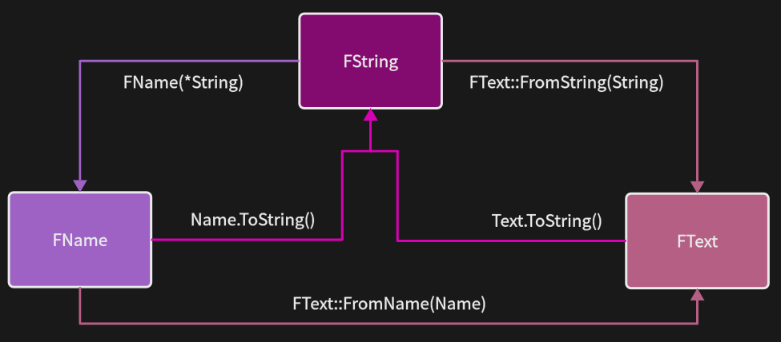

# 区别

|       | FString | FText | FName |
| ----- | ------- | ----- | ----- |
| 可修改   | 是       | 否     | 否     |
| 本地化支持 | 否       | 是     | 否     |
| 大小写敏感 |         |       | 否     |
| 唯一性   |         |       | 是     |
| 消耗    | 高       |       |       |

因为 FString 的性能开销较大，所以为了满足不同游戏开发中的性能需求，要选择合适的字符串类

- **FName**：主要用于*命名*，不区分大小写、并且具有唯一性，所以可以用来做 Key 方便快速定位资源，并且创建时会计算 Hash，实现比较时对比的是 Hash，时间复杂度为 O(1)，比 `std::string` 更快
- **FText**：强调“*显示*”，主要是为了支持本地化
- **FString**：和 `std::string` 类似，也是*唯一可修改的字符串类*，本质是一个地址类型，有大量的操作字符串的方法，也因此性能较差

`FString str = TEXT("Hello");`
- 如果不使用 TEXT 宏，将会使用 ANSI 对文字编码，导致支持字符高度受限，容易产生乱码

---
# 转换

| From↓To→ | FName             | FText                       | FString           |
| -------- | ----------------- | --------------------------- | ----------------- |
| FName    | X                 | `FText::FromName(Name)`     | `Name.ToString()` |
| FText    | 不存在               | X                           | `Test.ToString()` |
| FString  | `FName (*String)` | `FText::FromString(String)` | X                 |

---
# 参考
- [Unreal TEXT FText,FName,FString 浅谈 - 不三周助 - 博客园](https://www.cnblogs.com/u3ddjw/p/12307381.html)
- [UE4 随笔：FString、FName 与 FText - 知乎](https://zhuanlan.zhihu.com/p/408359058)
- [FName/FString/FText 的区别 | 虚幻社区知识库](https://ue5wiki.com/wiki/41082/)

