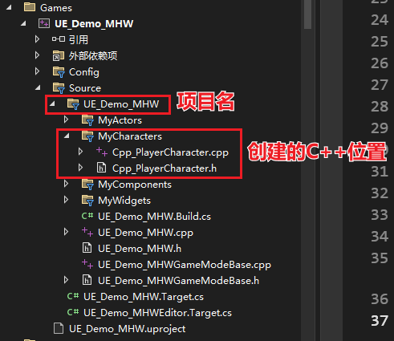
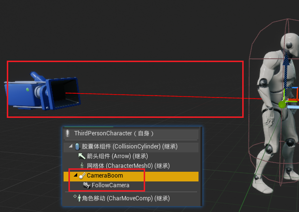
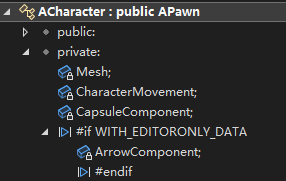
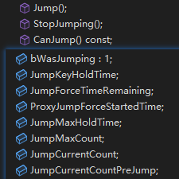
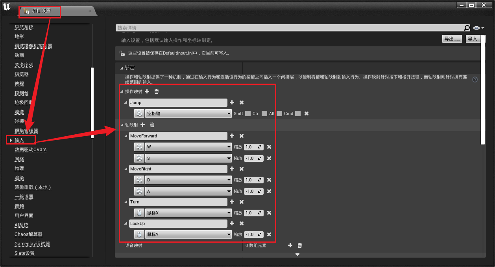
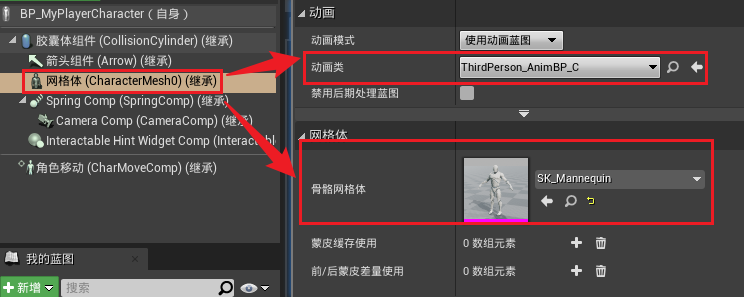
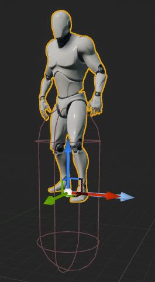
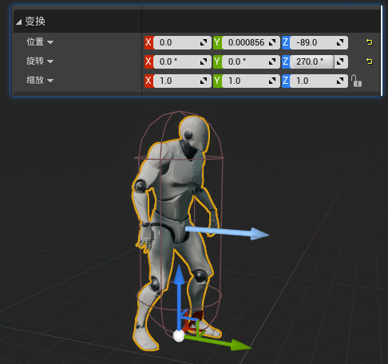

> UE 4.27 源码版本，VS 2022 17.9.6

目标：利用 C++ 实现第三人称角色，支持移动、跳跃。

---
# 创建 C++ 类

编辑器中：创建 C++ 类，选择 character 继承

这里需要注意，如果选择了新建文件夹创建，记得在 `.cpp` 文件中，将 `#include "MyCharacters/Cpp_PlayerCharacter.h"` 修改正确



正确的：`#include "Cpp_PlayerCharacter.h"`

---
# 阅读 C++ 代码

先来看一下官方的第三人称示例中，相机的设置方式。



添加了一个弹簧臂组件，一个相机组件。并且根据上图还能推断，这两个是在该蓝图中自动添加的，其余的箭头组件，胶囊提组件等后方都带有**继承**字样，说明这些都是继承自父类已经设置好的属性。

接下来看一下源码：

```cpp
#pragma once

#include "CoreMinimal.h"
#include "GameFramework/Character.h"
#include "Cpp_PlayerCharacter.generated.h"

UCLASS()
class UE_DEMO_MHW_API ACpp_PlayerCharacter : public ACharacter
{
	GENERATED_BODY()

public:
	// 构造函数，在这里进行默认设置
	ACpp_PlayerCharacter();

protected:
	// 游戏开始或角色 spawn 之后执行
	virtual void BeginPlay() override;

public:	
	// 每一帧更新
	virtual void Tick(float DeltaTime) override;

	// 在这里绑定轴映射和操作映射
	virtual void SetupPlayerInputComponent(class UInputComponent* PlayerInputComponent) override;

};
```

点进 `ACharacter` 查看源码，利用番茄助手查看文件大纲



可以得到几个信息：
- `ACharacter` 继承自 `APawn`
- 几个组件
  - `Mesh`
  - `CharacterMovement`
  - `CapsuleMovement`
  - `ArrowComponent`

和之前通过蓝图推断的结果相同，这几个组件是在 `ACharacter` 中添加好的


---
# 相机的添加与设置

这部分算是添加任何一个 Component 时都要进行的操作了


## 引入组件的头文件

虽然直接去声明对应的组件不会报错，但一旦在源文件里使用就会提示 `不完整的类类型`，这时候引入头文件即可

```cpp
#include "Camera/CameraComponent.h"
#include "GameFramework/SpringArmComponent.h"
```

## 类中声明组件

```cpp
public:

// 弹簧臂组件
	UPROPERTY(VisibleAnywhere, BlueprintReadOnly, Category=Camera, meta=(AllowPrivateAccess="true"))
	class USpringArmComponent* SpringComp;
// 摄像机组件    
	UPROPERTY(VisibleAnywhere, BlueprintReadOnly, Category=Camera, meta=(AllowPrivateAccess="true"))
	class UCameraComponent* CameraComp;
```

## 在构造函数中构造并设置组件

```cpp
/* 构建相机组件 */
CameraComp = CreateDefaultSubobject<UCameraComponent>(TEXT("CameraComp"));
/* 构建弹簧臂组件 */
SpringComp = CreateDefaultSubobject<USpringArmComponent>(TEXT("SpringComp"));
```

`CreateDefaultSubobject()` 参考笔记：[CreateDefaultSubobject()](../../U++学习/CreateDefaultSubobject().md)

## 设置组件的依附

这一步比较重要，如果类中没有任何组件，是一个空的 `Actor`，添加了 `Component` 后会自动将第一个组件设置为默认的场景根组件

> 对于我个人而言，我会特地创建一个默认的场景组件作为根组件，而不是将其他的组件设置为根组件
> ```cpp
> /* 创建默认根组件 */
> DefaultSceneRoot = CreateDefaultSubobject<USceneComponent>(TEXT("DefaultRootScene"));
> SetRootComponent(DefaultSceneRoot);
> ```

最重要的一点：**一定要记得设置依附层级关系，尤其是对场景根组件的依附设置，创建一个就设置依附于根组件（除了需要依附其他组件的情况）**，否则会出现将 `Actor` 拖入场景中后组件之间发生偏移的情况

```cpp
/* 弹簧臂附加到根节点 */
SpringComp->SetupAttachment(RootComponent);
/* 相机附加到弹簧臂 */
CameraComp->SetupAttachment(SpringComp);
```

这里涉及到`SetupAttachment`和`AttachToComponent`，参考笔记：[两种组件层级设置方式](../../学习笔记/UE源码相关/Component/组件依附：SetupAttachment和AttachToComponent.md)

## 设置组件默认值

在这里就针对需要的组件进行相关设置就好

```cpp
/* 使用 pawn 控制旋转 */
SpringComp->bUsePawnControlRotation = true;
CameraComp->bUsePawnControlRotation = true;
/* 关闭控制器旋转 */
bUseControllerRotationRoll = false;
bUseControllerRotationYaw = false;
bUseControllerRotationPitch = false;
/* 旋转朝向运动方向 */
GetCharacterMovement()->bOrientRotationToMovement = true;
```

在这里是对相机的设置，这些具体的区别可以查看[这里](../../学习笔记/UE源码相关/控制旋转和旋转朝向运动.md)

至此，角色相机的设置就完成了。

---
# 角色的移动设置

## 查看移动相关的源码

在父类 `ACharacter` 中不存在移动相关的函数，不过存在不少和 `Jump` 相关的属性和方法：



对于 `CharacterMovementComponent` 以下简称 `CMC`，该组件提供了移动相关的逻辑，利用当前速度和加速度来驱动运动，并且支持联网功能，不过似乎不存在可供重写的类似 `void MoveForward()` 函数。

而在 `ACharacter` 的父类 `APawn` 中，提供了一个 `AddMovementInput()` 方法，声明如下：

```cpp
UFUNCTION(BlueprintCallable, Category="Pawn|Input", meta=(Keywords="AddInput"))
virtual void AddMovementInput(FVector WorldDirection, float ScaleValue = 1.0f, bool bForce = false);
```

该函数接收一个世界空间的方向向量和一个缩放因子，以及是否受力的布尔变量

查看方法实现发现，`CMC` 实际上是在 `APawn` 中参与的运动相关逻辑，如果存在`CMC`组件就会调用组件的 `AddInputVector()` 方法，不存在则调用 `APawn` 中的 `Internal_AddMovementInput()` 方法

```cpp
UFUNCTION(BlueprintCallable, Category="Pawn|Components|PawnMovement")
virtual void AddInputVector(FVector WorldVector, bool bForce = false);
```

该方法会检测是否存在 `PawnOwner`，如果存在最终还是会调用 `APawn` 中的 `Internal_AddMovementInput()` 方法

```cpp
void Internal_AddMovementInput(FVector WorldAccel, bool bForce = false);
```

## 实现移动

根据之前的观察，我们需要在自定义的这个 Character 类中，调用 `AddMovementInput()` 实现角色的移动

这个方法接收一个世界空间的方向向量和一个缩放因子（`bForce`暂不讨论）

先在自定义角色中声明运动控制方法：

```cpp
public:
	// 移动控制
	void MoveForward(float Value);
	void MoveRight(float Value);
    // 视角转向控制
	void Turn(float Value);
	void LookUp(float Value);
    // 跳跃控制
	virtual void Jump() override;
	virtual void StopJumping() override;
```

角色是通过控制器被玩家操控的，所以需要从控制器中获取当前输入信息，以此判断玩家期望的角色运动方向


通过下面代码获取控制器的旋转信息：

```cpp
/* 获取控制器旋转 */
const FRotator ControllerRotator = Controller->GetControlRotation();
```

由于这里的角色被限制在地面上，所以这里只保留对 z 轴的旋转

```cpp
const FRotator YawRotator(0.f, ControllerRotator.Yaw, 0.f);
```

如果需要的是向前移动方向，

```cpp
const FVector Direction = FRotationMatrix(YawRotator).GetUnitAxis(EAxis::X);
```

同理，向右移动方向

```cpp
const FVector Direction = FRotationMatrix(YawRotator).GetUnitAxis(EAxis::Y);
```

注意这里只保留了向量的方向信息

最后：

```cpp
AddMovementInput(Direction, Value);
```

综上：

```cpp
void ACpp_PlayerCharacter::MoveForward(float Value)
{
	if (Controller != nullptr && Value != 0)
	{
		/* 获取控制器旋转 */
		const FRotator ControllerRotator = Controller->GetControlRotation();
		/* 只保留 z 轴旋转*/
		const FRotator YawRotator(0.f, ControllerRotator.Yaw, 0.f);
		/* 前向向量 */
		const FVector Direction = FRotationMatrix(YawRotator).GetUnitAxis(EAxis::X);
		/* 应用移动 */
		AddMovementInput(Direction, Value);
	}
}
```

向右同理

## 绑定映射

刚刚只是实现了运动方法，还需要与控制器的输入信息建立映射关系，按照下图设置



接下来回到代码中，`void ACpp_PlayerCharacter::SetupPlayerInputComponent(UInputComponent* PlayerInputComponent)` 这个方法负责建立映射关系，将之前设置好的映射关系上绑定对应的运动函数

代码如下：

```cpp
void ACpp_PlayerCharacter::SetupPlayerInputComponent(UInputComponent* PlayerInputComponent)
{
	Super::SetupPlayerInputComponent(PlayerInputComponent);

	/* 绑定轴映射 */
	PlayerInputComponent->BindAxis("MoveForward", this, &ACpp_PlayerCharacter::MoveForward);
	PlayerInputComponent->BindAxis("MoveRight", this, &ACpp_PlayerCharacter::MoveRight);
	PlayerInputComponent->BindAxis("Turn", this, &ACpp_PlayerCharacter::Turn);
	PlayerInputComponent->BindAxis("LookUp", this, &ACpp_PlayerCharacter::LookUp);
	/* 绑定动作映射 */
	PlayerInputComponent->BindAction("Jump", IE_Pressed, this, &ACpp_PlayerCharacter::Jump);
	PlayerInputComponent->BindAction("Jump", IE_Released, this, &ACpp_PlayerCharacter::StopJumping);
}
```

## 视角旋转

这部分设置控制器操控视角的旋转，主要是两个方式：左右`Turn()`和上下`LookUp()`

```cpp
void ACpp_PlayerCharacter::Turn(float Value)
{
	if (Controller != nullptr && Value != 0)
	{
		AddControllerYawInput(Value);
	}
}

void ACpp_PlayerCharacter::LookUp(float Value)
{
	if (Controller != nullptr && Value != 0)
	{
		AddControllerPitchInput(Value);
	}
}
```

## 跳跃

这里不打算修改，所以直接调用父类的跳跃函数

```cpp
void ACpp_PlayerCharacter::Jump()
{
	Super::Jump();
}

void ACpp_PlayerCharacter::StopJumping()
{
	Super::StopJumping();
}
```

# 5. 测试


# 补充

之前忘记提需要在蓝图中的设置了

按照上边步骤设置完后编译运行，发现角色蓝图中看不到角色，需要选择网格体并设置骨骼网格体和对应的动画蓝图



另外还可能发现添加骨骼网格体后出现偏移的情况：



个人的设置：


