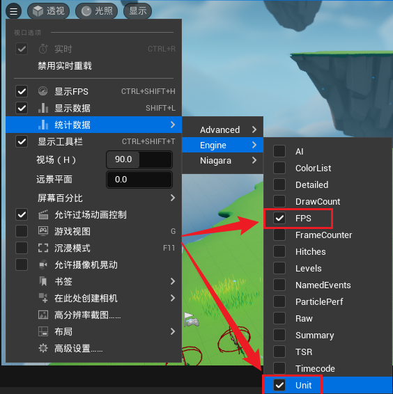
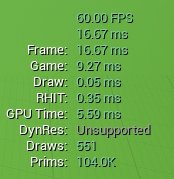
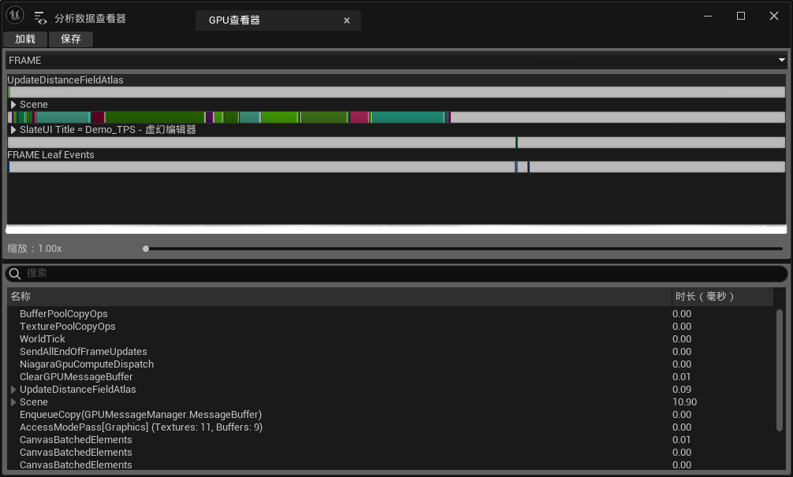
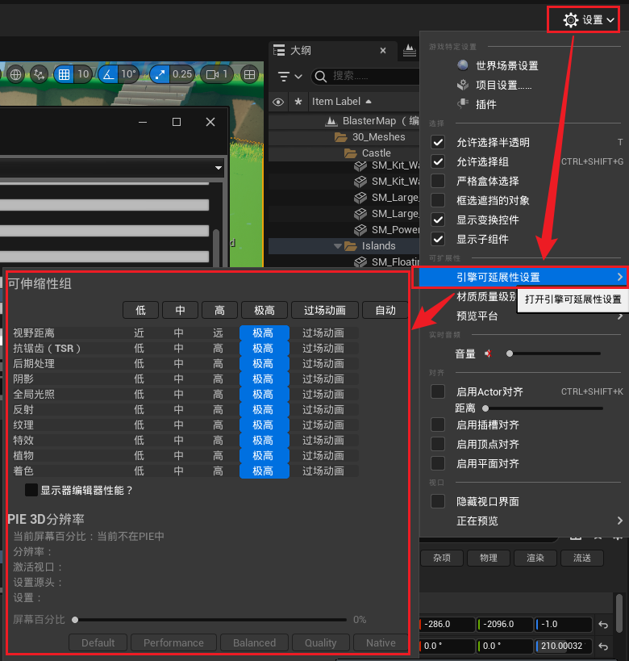
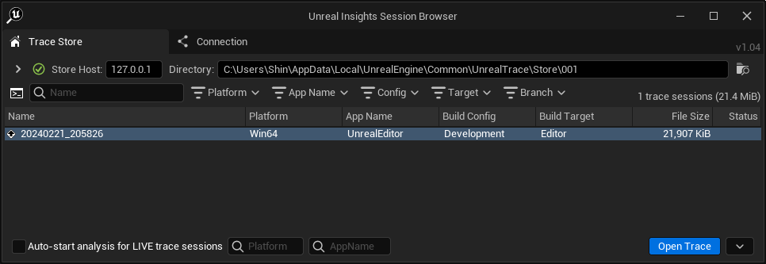

# 方法一：Stat

在编辑器界面的游戏窗口内，常用两个：FPS 和 Unit

显示效果：

前者显示 FPS，后者显示游戏线程、渲染线程和 GPU 的帧速率，以及 DrawCall 和 Primitive 数量

如果在编辑器中运行游戏，可以通过命令行输入 `stat unit` 或者 `stat fps` 开启：

---
# 方法二：GPU Profile

快捷键：`ctrl + shift + .`

引擎中可以打开这里进行设置：

---
# 方法三：Unreal Insight

路径一般在：`\Engine\Binaries\Win64`

注：
- UnrealInsight 对内存要求比较高
- 以及其生成的 log 文件可能比较大

也可以检测内存泄漏问题

---
# 参考链接
- [【UE5】10 分钟学会 UE5 性能分析，让你的游戏帧数起飞\_哔哩哔哩\_bilibili](https://www.bilibili.com/video/BV18C4y1A7Np?vd_source=4ca316b11bb8c03c238d1da54c1ba5f0)
- [Unreal Insights | Unreal Engine 4.27 Documentation](https://docs.unrealengine.com/4.27/en-US/TestingAndOptimization/PerformanceAndProfiling/UnrealInsights/)
