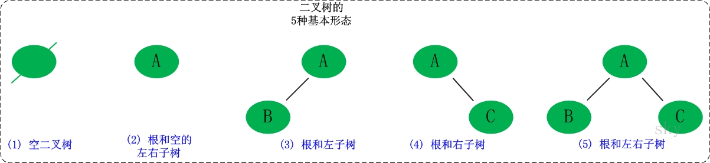

# 二叉树



## 二叉树的定义

```cpp
struct TreeNode {
    int val;
    TreeNode* left;
    TreeNode* right;
    TreeNode(int x) : val(x),left(nullptr),right(nullptr) {}
};
```

## 二叉树的种类

### 满二叉树和完全二叉树

解题中的二叉树一般为**满二叉树**和**完全二叉树**

**满二叉树**：节点度只有 0 和 2，且度为 0 的节点在同一层的二叉树
- 深度为 $k$
- 结点数为 $2^k-1$


**完全二叉树**：除了底层节点，其余层的节点数都为最大值

### 二叉搜索树

**具有数值的有序树**，结点数值规则：
- 左子树非空，左子树结点值均小于根节点值
- 右子树非空，右子树结点值均大于根节点值
- 左、右子树同样为二叉搜索树

### 平衡二叉搜索树（AVL）

性质：空树，或左右子树高度差不超过 1，并且左右子树都为 AVL

> map、set、multimap、multiset 底层实现都是 AVL
> 因此，增删操作时间复杂度都为 $O(\log n)$
> **注意，unordered_map 和 unordered_set 底层为哈希表**

## 二叉树的存储方式

链式存储（指针）或顺序存储（数组）

链式存储很常见，这里简述一下顺序存储

参考下图：

**下标为 i 的父节点，左孩子为 $2\cdot i + 1$，右孩子为 $2\cdot i + 2$**


## 二叉树的遍历方式

两种主要方式：
- 深度优先：优先访问子节点
- 广度优先：优先访问同级结点

> 一种神级遍历二叉树的方式：morris 遍历
> 参考链接：
> [Morris 遍历](https://ghh3809.github.io/2018/08/06/morris-traversal/#morris%E9%81%8D%E5%8E%86)
> [神级遍历——morris](https://zhuanlan.zhihu.com/p/101321696)


### 深度优先遍历

深度优先分为三种：（以根节点访问位次区分）

1. 前序遍历（递归法，迭代法）中左右
2. 中序遍历（递归法，迭代法）左中右
3. 后序遍历（递归法，迭代法）左右中

#### 递归实现

适合递归实现，本质上是**基于栈实现**。

```cpp
// 确定递归参数和返回值
void DepthSearch(TreeNode* root, vector<int>& res) {  // res 是结果
    // 设置递归终止条件
    if (!root) { return; }

    // 单层递归的逻辑
    // 这里根据遍历的顺序来进行调整，即可实现三种遍历
    res.push_back(root->val);      // mid/root
    DepthSearch(root->left, res);  // left
    DepthSearch(root->right, res); // right
}
```

#### 迭代实现

和递归本质上相同，都是借助栈实现。核心思想：利用栈记录每一个结点及其左右节点的处理顺序。

例如前序遍历，用父节点初始化栈再弹出处理，并将左右节点按顺序入栈，再依次弹出处理

对于前序遍历，顺序为：中左右。

关键在于：左和右的入栈顺序，因为栈先进后出，所以右结点后出，应当先入栈

```cpp
void PreOrder(TreeNode* root, vector<int>& ret) {
    if(root==nullptr) return ;
    stack<TreeNode*> st;
    st.push(root);
    while(!st.empty()) {
        TreeNode* cur = st.top(); st.pop();
        ret.push_back(cur->val);
        // 注意左右入栈顺序
        if(cur->right) st.push(cur->right);
        if(cur->left) st.push(cur->left);
    }
}
```

后序遍历，顺序为：左右中。可以通过对前序遍历进行些许改动实现：
- 前序遍历顺序为中左右，修改左右结点入栈顺序：中右左
- 如果此时将顺序反向就变成了：左右中

```cpp
void PostOrder(TreeNode* root, vector<int>& ret) {
    if(root==nullptr) return ;
    stack<TreeNode*> st;
    st.push(root);
    while(!st.empty()) {
        TreeNode* cur = st.top(); st.pop();
        ret.push_back(cur->val);
        // 修改前序遍历的入栈顺序
        if(cur->left) st.push(cur->left);
        if(cur->right) st.push(cur->right);
    }
    reverse(ret.begin(), ret.end());
}
```

**难点在于中序遍历**，由于中序遍历顺序为：左中右。这导致在当前访问的根节点压入容器之前，需要先将其左子树进行遍历，然后处理根节点，再处理右结点

```cpp
void InOrder(TreeNode* root, vector<int>& ret) {
    vector<int> ret;
    if(root==nullptr) return ;
    stack<TreeNode*> st;
    TreeNode* cur = root;
    while(cur!=nullptr || !st.empty()) {
        if(cur!=nullptr) { // 左节点入栈
            st.push(cur);
            cur = cur->left;
        }
        else { // 没有最左节点了
            cur = st.top(); st.pop(); // 挨个出栈
            ret.push_back(cur->val);
            cur = cur->right; // 处理右节点
        }
    }
}
```

#### 统一迭代实现

中序遍历的迭代实现和前序后序不统一的根本问题在于：中序遍历是的访问结点和处理结点的结点对象不一致。

在前序中，当前访问的结点（出栈结点）就是需要处理（压入返回）的结点。而中序遍历，由于顺序问题，中结点压入返回前需要先处理左结点，从而导致需要对结点进行左节点的指针遍历操作。


### 广度优先遍历

可以借助队列实现

```cpp
void LayerSearch(TreeNode* root) {
    if(!root) return ;
    int depth = 0;
    queue<TreeNode*> que;
    que.push(root);
    while(!que.empty()) {
        int size = que.size();
        while(size--) {
            TreeNode* cur = que.front(); que.pop();
            //
            if(cur->left) que.push(cur->left);
            if(cur->right) que.push(cur->right);
        }
        depth++;
    }
}
```

## 二叉树的性质

- 性质 1：二叉树第 `i` 层上的节点数目最多为 `2{i-1} (i≥1)`。
- 性质 2：深度为 `k` 的二叉树至多有 `2{k}-1` 个节点`（k>=1）`。
- 性质 3：包含 `n` 个节点的二叉树的高度至少为 `log2 (n+1)`。
- 性质 4：在任意一颗二叉树中，若终端节点的个数为 `n0`，度为 `2` 的节点数为 `n2`，则 `n0=n2+1`

**高度**和**深度**
- 深度：根节点到任意一个结点，从上往下数，用前序遍历
- 高度：根节点到叶子结点（根节点最大），从下往上数，用后序遍历


## 二叉树的修改与构造

## 求二叉搜索树的属性

## 二叉树公共祖先问题

## 二叉搜索树的修改与构造

构造二叉树：
- **核心**：中序用以区分左右子树，其他遍历提供根节点

### 前序 + 中序

### 后序 + 中序


### 层序 + 中序


# 参考链接

- [二叉树知识点最详细最全讲解](https://blog.csdn.net/qq_41404557/article/details/115447169)
- [二叉树理论基础](https://github.com/youngyangyang04/leetcode-master/blob/master/problems/%E4%BA%8C%E5%8F%89%E6%A0%91%E7%90%86%E8%AE%BA%E5%9F%BA%E7%A1%80.md)