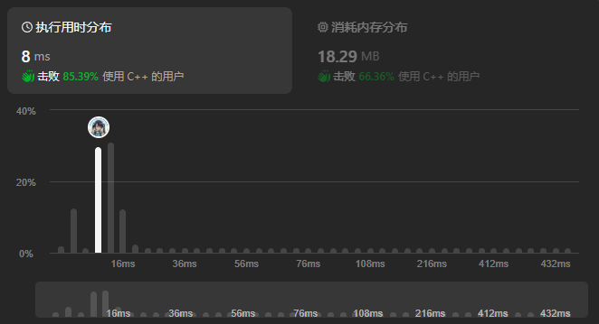

题目链接：[26 删除有序数组的重复项](https://leetcode.cn/problems/remove-duplicates-from-sorted-array/description/)

给你一个非严格递增排列的数组 `nums` ，请你原地删除重复出现的元素，使每个元素只出现一次，返回删除后数组的新长度。元素的相对顺序应该保持一致。然后返回 `nums` 中唯一元素的个数。

考虑 `nums` 的唯一元素的数量为 k，你需要做以下事情确保你的题解可以被通过：

更改数组 `nums` ，使 `nums` 的前 k 个元素包含唯一元素，并按照它们最初在 `nums` 中出现的顺序排列。`nums` 的其余元素与 `nums` 的大小不重要。
返回 k。
判题标准：

系统会用下面的代码来测试你的题解：

```cpp
int[] nums = [...]; // 输入数组
int[] expectedNums = [...]; // 长度正确的期望答案

int k = removeDuplicates(nums); // 调用

assert k == expectedNums.length;
for (int i = 0; i < k; i++) {
    assert nums[i] == expectedNums[i];
}
```
如果所有断言都通过，那么您的题解将被 通过。

示例 1：
```cpp
输入：nums = [1,1,2]
输出：2, nums = [1,2,_]
解释：函数应该返回新的长度 2 ，并且原数组 nums 的前两个元素被修改为 1, 2 。不需要考虑数组中超出新长度后面的元素。
```
示例 2：
```cpp
输入：nums = [0,0,1,1,1,2,2,3,3,4]
输出：5, nums = [0,1,2,3,4]
解释：函数应该返回新的长度 5 ， 并且原数组 nums 的前五个元素被修改为 0, 1, 2, 3, 4 。不需要考虑数组中超出新长度后面的元素。
 
```

提示：
- `1 <= nums.length <= 3 * 104`
- `-104 <= nums[i] <= 104`
- `nums` 已按非严格递增排列

<!--more-->

---

# 题解

## 阅读题目，确定以下信息

- `nums` 去掉重复元素后为有序递增数组
- `nums` 最少也会有一个元素
- 处理后的`nums`需要保证前 `k` 个元素相对位置不变，并且无重复
- `k`为`nums`中元素个数（重复元素计算 1 次）


## 主要方法

**双指针法**（快慢指针）:
- 快指针 `fast`：扫描数组
- 慢指针 `slow`：定位目标位置


## 制定步骤

- 快慢指针初始化指向首元素
- 快指针`fast`使用`for`循环对`nums`进行遍历
- 对每一个`fast`位置和`slow`位置进行比较
  - `nums[slow]==nums[fast]`
    - 说明此时出现重复元素，不做任何处理利用`for`循环自动更新`fast`指针
    - 直到`fast`指向第一个不同元素
  - `nums[slow]!=nums[fast]`
    - 说明找到了不同的元素，将该不同元素放在`slow`的下一个位置，并更新`slow`指针
    - `nums[++slow]=nums[fast]`

复杂度分析：
- 空间复杂度：$O(1)$
- 时间复杂度：$O(n)$

# 提交

## 代码
```cpp
class Solution {
public:
    int removeDuplicates(vector<int>& nums) {
        int slow = 0; // 慢指针
        for(int fast=0;fast<nums.size();fast++) // 快指针遍历 nums
        {
            if(nums[fast]!=nums[slow]) 
            {// 快指针与插入位置元素不同
                nums[++slow] = nums[fast]; // 将快指针元素插入 slow 的下一个位置
            }
        }
        return slow+1; // slow 为下标，换为实际的位序需要 +1
    }
};
```
## 执行

