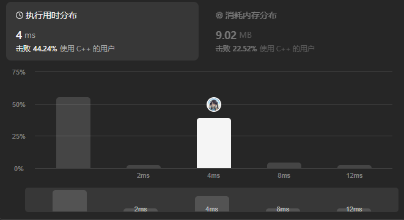
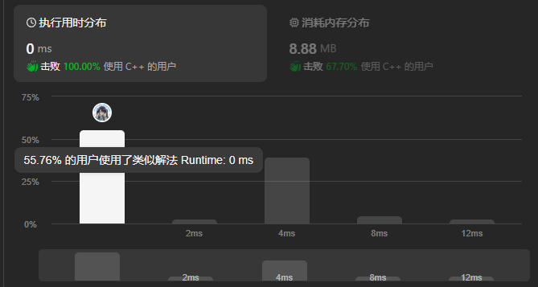

题目链接：[27 移除元素](https://leetcode.cn/problems/remove-element/)

给你一个数组 nums 和一个值 val，你需要原地移除所有数值等于 val 的元素，并返回移除后数组的新长度。

不要使用额外的数组空间，你必须仅使用 O(1) 额外空间并 原地 修改输入数组。

元素的顺序可以改变。你不需要考虑数组中超出新长度后面的元素。

说明：

为什么返回数值是整数，但输出的答案是数组呢？

请注意，输入数组是以「引用」方式传递的，这意味着在函数里修改输入数组对于调用者是可见的。

你可以想象内部操作如下：
```cpp
// nums 是以“引用”方式传递的。也就是说，不对实参作任何拷贝
int len = removeElement(nums, val);

// 在函数里修改输入数组对于调用者是可见的。
// 根据你的函数返回的长度，它会打印出数组中 该长度范围内 的所有元素。
for (int i = 0; i < len; i++) {
    print(nums[i]);
}
 ```

示例 1：
```cpp
输入：nums = [3,2,2,3], val = 3
输出：2, nums = [2,2]
解释：函数应该返回新的长度 2, 并且 nums 中的前两个元素均为 2。你不需要考虑数组中超出新长度后面的元素。例如，函数返回的新长度为 2 ，而 nums = [2,2,3,3] 或 nums = [2,2,0,0]，也会被视作正确答案。
```

示例 2：
```cpp
输入：nums = [0,1,2,2,3,0,4,2], val = 2
输出：5, nums = [0,1,3,0,4]
解释：函数应该返回新的长度 5, 并且 nums 中的前五个元素为 0, 1, 3, 0, 4。注意这五个元素可为任意顺序。你不需要考虑数组中超出新长度后面的元素。
```

提示：
-  `0 <= nums.length <= 100`
-  `0 <= nums[i] <= 50`
-  `0 <= val <= 100`

<!--more-->

---

# 题解

我的思路是双向迭代器法：**利用 vector 容器的 begin 和 end，从容器两端开始迭代，依次将容器尾部不是 val 的元素移动到容器前边是 val 的位置**

## 详细步骤

- begin 从头开始寻找 val，如果找到则 count++ 记录找到了多少个 val
  - 此时需要找到尾部可以移动的非 val 元素
- end 从尾部开始寻找 val（end 初始位于尾后所以这里要使用--end），目的是找到最后一个不是 val 的元素，将其移动到 begin 的位置
  - 同时要注意判断 end 没有与 begin 重合（防止重复计数）
  - 从尾部向前寻找第一个不是 val 的元素，找到则跳出循环
- 此时需要防止跳出循环的原因是 begin 与 end 相遇
  - 如果是`*(--end) != val`从而跳出循环，则执行后续交换
  - 如果是`begin == end`从而跳出循环，则说明容器没有其他可交换元素了，需要停止迭代

复杂度分析：
- 空间复杂度：$O(1)$
- 时间复杂度:$O(n)$

## 代码
```cpp
class Solution {
public:
    int removeElement(vector<int>& nums, int val) {
        int count = 0; // 记录容器中 val 元素个数
        auto end = nums.end(); // 双迭代器
        for(auto begin=nums.begin();begin!=end;begin++)
        {
            if(*begin == val) // 找到了 val
            {
                ++count; // 记录从首端开始找到的 val
                
                // 从尾部寻找替换元素并检查 begin 与 end 是否相遇
                while(*(--end) == val && begin!=end)
                {
                    ++count; // 记录从尾部开始找到的 val
                }
                
                // 确认 while 循环跳出是不是因为迭代器相遇了
                if(begin == end) 
                {// 也能处理 nums 只有一个元素的情况
                    break;
                }
                
                // 交换 begin 和 end 所指向元素
                auto temp = *begin;
                *begin  = *end;
                *end = temp; 
            }
        }
        // 返回非 val 元素个数
        return nums.size() - count;
    }
};
```
## 执行


# 方法二：快慢指针

- `slow`指针指向目标位置
- `fast`指针遍历 nums

步骤：
- 指针初始化为首元素位置
- 比较`val`和`fast`
  - `val == nums[fast]`
    - 需要继续移动`fast`直到找到非`val`元素
  - `val != nums[fast]`
    - 此时将`fast`位置的非`val`元素移动到`slow`指针位置
    - 并更新`slow`指针
- 遍历结束，`slow`指针所指元素的位序即为删除元素后的数组长度

代码：
```cpp
class Solution {
public:
    int removeElement(vector<int>& nums, int val) {
        int slow = 0;
        for(int fast=0;fast<nums.size();fast++)
        {
            if(val!=nums[fast])
            {
                nums[slow++] = nums[fast];
            }
        }
        return slow;
    }
};
```
提交：

