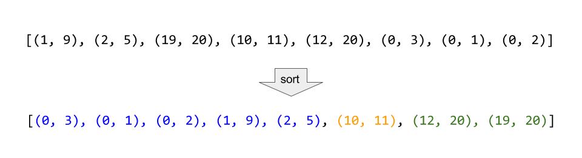

题目链接：

以数组 `intervals` 表示若干个区间的集合，其中单个区间为 `intervals[i] = [starti, endi]` 。请你合并所有重叠的区间，并返回 _一个不重叠的区间数组，该数组需恰好覆盖输入中的所有区间_ 。

**示例 1：**

输入：intervals = [[1,3],[2,6],[8,10],[15,18]]
输出：[[1,6],[8,10],[15,18]]
解释：区间 [1,3] 和 [2,6] 重叠，将它们合并为 [1,6].

**示例 2：**

输入：intervals = [[1,4],[4,5]]
输出：[[1,5]]
解释：区间 [1,4] 和 [4,5] 可被视为重叠区间。

**提示：**

- `1 <= intervals.length <= 104`
- `intervals[i].length == 2`
- `0 <= starti <= endi <= 104`

<!--more-->

---

# 题解

根据题意，两个区间可以合并的条件如下：
```cpp
[start1, end1], [start2, end2]
overlap >> (start1 <= end2 && start2 <= end1)
```

一般的思路，都会想到从左到右遍历 `intervals` 然后比较相邻的区间是否满足合并条件。但这种遍历隐含着一个条件：**可合并的区间，必须是连续的**



但实际上区间可能以下面方式排列：
```cpp
[[2,3],[4,5],[6,7],[8,9],[1,10]]
```

很显然，如果直接按照顺序遍历，前四个区间都不会合并，第五个区间也不会去合并，然而实际上这五个区间都可以合并。

观察这些区间，可以发现第五个区间的 `start`，是这些区间内最小的。如果这个区间位于容器的第一个位置，再次对容器进行遍历的话，可以很顺利的将这五个区间合并。

也就是说，要想让容器内区间排列满足条件，需要以区间的 `start` 作为比较对象进行排序。

```cpp
sort(intervals.begin(), intervals.end())
```

此时，容器内的区间应当满足：**可合并区间是相邻并连续的**

这里可以很简单的反证一下：

假如有三个区间，`a1, a2, a3`，他们以 `start` 排序，但是不满足**可合并区间连续**的条件，也就是 a 1 和 a 3 可合并，但是 a 1 和 a 2，a 2 和 a 3 都无法合并：

$$
\begin{align*}
&a1.start < a2.start < a3.start\\
&a1.end < a2.start \\
&a2.end < a3.start \\
&a1.end >= a3.start
\end{align*}
$$

可以发现上边的关系中，

$$
a1.end < a2.start\ \&\&\ a2.end < a3.start
$$

并且 $a2.start <= a2.end$ 因此有，

$$
a1.end < a3.start
$$

然而按照我们的假设条件中，a1 和 a3 应当是可以合并的，需要满足 $a1.end >= a3.start$，出现了矛盾，说明我们的假设 a2 不可以合并是错误的。

下面给出代码：

```cpp
class Solution
{
    vector<vector<int>> merge(vector<vector<int>>& intervals)
    {
        // 单个区间返回自己
        if(intervals.size() == 1) return intervals;
        // 对区间排序，保证可合并区间连续排列
        sort(intervals.begin(), intervals.end());

        vector<vector<int>> ret; // 返回值
        vector<int> current_interval = intervals[0]; // 记录当前合并区间
        // 对区间进行遍历
        for(int i=0; i<intervals.size(); i++)
        {
            // 判断是否可以合并
            if(current_interval[0] <= intervals[i][1] && intervals[i][0] <= current_intervals[1])
            {
                // 更新区间
                current_interval[0] = min(current_interval[0], intervals[i][0]);
                current_interval[1] = max(current_interval[1], intervals[i][1]);
            }
            else
            {
                // 如果不满足合并条件，将已经合并过的区间压入容器
                ret.push_back(current_interval);
                // 更新为新区间继续寻找
                current_interval = intervals[i];
            }
        }
        // 遍历到最后一个区间，不管区间是否被上一个区间合并，都会跳出循环
        // 需要额外将最后一个合并区间压入容器
        ret.push_back(current_interval);

        return ret;
    }
};
```

时间复杂度分析：

- 空间复杂度上，如果不考虑返回值占用的空间，由于发生了对容器的排序，所以需要额外的空间为 $O(\log{n})$
- 时间复杂度上，对容器排序为 $O(n\log{n})$，对容器遍历为 $O(n)$

