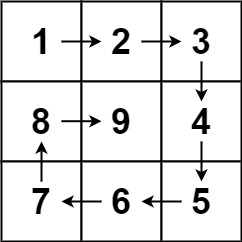

题目链接：[59 螺旋矩阵 II](https://leetcode.cn/problems/spiral-matrix-ii/description/)

给你一个正整数 n，生成一个包含 1 到 n2 所有元素，且元素按顺时针顺序螺旋排列的 n x n 正方形矩阵 matrix。



<!--more-->

---

# 题解

填充顺序如下：

- 从左上到右上
- 从右上到右下
- 从右下到左下
- 从左下到左上

循环该过程，逐步向内填充

在每一步填充时选择左闭右开的范围

```cpp
class Solution {
public:
    vector<vector<int>> generateMatrix(int n) {
        vector<vector<int>> ret(n, vector<int>(n, 0));
        // Start X,Y
        int startX = 0;
        int startY = 0;
        // Loop contronl
        int loop = n/2;
        // Each loop offset
        int offset = 1;
        // number
        int num = 1;
        /* Loop */
        while(loop--) {
            int i = startX;
            int j = startY;
            // Spiral matrix
            for(;j<n-offset;j++) ret[i][j] = num++;
            for(;i<n-offset;i++) ret[i][j] = num++;
            for(;j>startY;j--) ret[i][j] = num++;
            for(;i>startX;i--) ret[i][j] = num++;
            // Update each loop begin state
            startX++;
            startY++;
            offset++;
        }
        // When n is odd, set center
        if(n%2!=0)
            ret[n/2][n/2] = num;
            
        return ret;
    }
};
```

复杂度分析：
- 时间复杂度：$O(n^2)$
- 空间复杂度：$O(n)$

