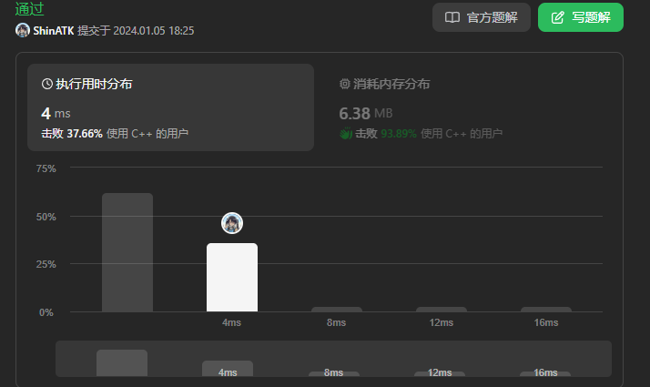
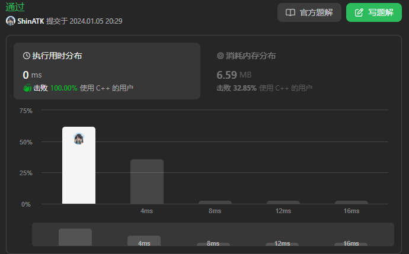

题目链接：[844 比较含退格的字符串](https://leetcode.cn/problems/backspace-string-compare/description/)

给定 s 和 t 两个字符串，当它们分别被输入到空白的文本编辑器后，如果两者相等，返回 true 。# 代表退格字符。

注意：如果对空文本输入退格字符，文本继续为空。
 
示例 1：
```cpp
输入：s = "ab#c", t = "ad#c"
输出：true
解释：s 和 t 都会变成 "ac"。

```

示例 2：
```cpp
输入：s = "ab##", t = "c#d#"
输出：true
解释：s 和 t 都会变成 ""。

```

示例 3：
```cpp
输入：s = "a#c", t = "b"
输出：false
解释：s 会变成 "c"，但 t 仍然是 "b"。
```

提示：
- `1 <= s.length`, `t.length <= 200`
- s 和 t 只含有小写字母以及字符 '#'
 
进阶：
- 你可以用 O(n) 的时间复杂度和 O(1) 的空间复杂度解决该问题吗？

<!--more-->

---

# 题解

## 方法一：双指针

同样借鉴[27.移除元素](27.移除元素.md)中的方法，本题不同在于：
- 本题中slow指针表示要修改的位置，具体来说就是要删除的字符位置
  - 每多一个`#`就需要多删除一个字符
- 所以
  - fast找到一个目标值，就需要将slow位置前移一位
    - 需要注意slow不要移除界，需要保证`slow>=0`
  - fast不等于目标值时，将slow位置修改为fast，并`++slow`
- 处理完string中的退格`#`后，slow的位置的位序即为执行退格后，字符串的最终结果
- 所以，只需要比较0~slow范围内的字符即可

```cpp
class Solution {
public:
    bool backspaceCompare(string s, string t) {
        // 处理string s
        int slow1 = 0;
        for(int fast1=0;fast1<s.size();fast1++)
        {
            if(s[fast1]!='#')
            {
                s[slow1++] = s[fast1];
            }
            else
            {
                if(--slow1<0)
                    slow1=0;
            }
        }
        // 处理string t
        int slow2 = 0;
        for(int fast2=0;fast2<t.size();fast2++)
        {
            if(t[fast2]!='#')
            {
                t[slow2++] = t[fast2];
            }
            else
            {
                if(--slow2<0)
                    slow2=0;
            }
        }
        // 如果删除后二者字符数量不一致则肯定不相等
        if(slow1 != slow2)
            return false;
        // 比较两个最终的string
        for(int i=0;i<slow1;i++)
        {
            if(s[i]!=t[i])
                return false;
        }
        return true;
    }
};
```

复杂度分析：
- 时间复杂度：$O(n)$
  - 执行`#`操作需要遍历字符串，所以是 $O(n1+n2)$ 时间复杂度
  - 执行字符串比较，此时执行次数一定小于字符串原最大的值 $\max(n1, n2)$
  - 综上，时间复杂度为 $O(n)$
- 空间复杂度：$O(1)$，只涉及常数空间变量




## 方法二：利用栈

- 遍历string
  - 遇到字符元素，字符入栈
  - 遇到`#`，栈顶元素出栈
    - 栈空则跳过
- 对比栈中元素

```cpp
class Solution {
public:
    bool backspaceCompare(string s, string t) {
        return stack_str(s) == stack_str(t);
    }

    string stack_str(string str)
    {
        string stack;
        for(char ch : str)
        {
            if(ch != '#')
            {
                stack.push_back(ch);
            }
            else
            {
                if(!stack.empty())
                    stack.pop_back();
            }
        }
        return stack;
    }
};
```

复杂度分析：
- 时间复杂度为：$O(m+n)$
  - 需要遍历两个string
- 空间复杂度：$O(m+n)$
  - 入栈出栈操作的栈占用字符串大小



## 方法三：双指针（逆向版）

主要思路
- 一个`#`表示其之前的一个字符需要删除
- 如果对字符串进行反向遍历，问题就变为了：一个`#`“之后”的一个字符需要删除

同时对两个string反向遍历，使用`cnt`记录遇到`#`的个数
- 指向`#`，`++cnt`，前移指针
- 指向字符
  - `cnt!=0`，说明需要删除该字符，删除并前移指针，直至`cnt==0`
  - `cnt==0`，说明该字符需要保留，比较该位置字符
- 有一方提前结束遍历，说明二者长度不一致

**核心**：同时反向遍历，等二者能够各自确定一个字符会在最终结果中保留，对比这两个字符

```cpp
class Solution {
public:
    bool backspaceCompare(string S, string T) {
        int i = S.length() - 1, j = T.length() - 1;
        int skipS = 0, skipT = 0;

        while (i >= 0 || j >= 0) {
            // 找string S中的有效字符
            while (i >= 0) {
                if (S[i] == '#') {// 退格+1，指针-1
                    skipS++, i--;
                } else if (skipS > 0) { // 还需要进行退格
                    skipS--, i--; // 退格-1，指针-1
                } else {
                    break; // 找到一个可以保留的则跳出等待比较
                }
            }
            // 找string T中的有效字符
            while (j >= 0) {
                if (T[j] == '#') {
                    skipT++, j--;
                } else if (skipT > 0) {
                    skipT--, j--;
                } else {
                    break;
                }
            }
            // 对两个string的有效字符进行比较
            if (i >= 0 && j >= 0) { // 确保索引有效
                if (S[i] != T[j]) {
                    return false;
                }
            } else {
                if (i >= 0 || j >= 0) {
                    return false;
                }
            }
            i--, j--;
        }
        return true;
    }
};
```


