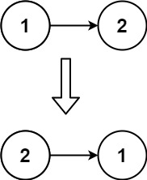

题目链接：[206 反转链表](https://leetcode.cn/problems/reverse-linked-list)

给你单链表的头节点 head，请你反转链表，并返回反转后的链表。


空链表则返回空链表

<!--more-->

---

# 题解

首先将问题简化为两个节点，如下图所示



反转这两个节点的步骤为：
- 断开 1->2
- 建立 2->1

**注意**：需要留意 1 是否为反转后的尾部，选择是否再将 1 指向 null

### 方法一：双指针迭代

- `slow`：上一个节点，初值设置为空，`NULL`
- `fast`：当前节点，初值设置为头节点，`head`

`fast` 遍历链表，根据 `fast` 为 `NULL` 作为循环结束条件，循环内
- 掉转节点指向
  - `temp` 保存下一个节点
  - `fast` 指向 `slow`
- 更新 `fast` 和 `slow` 位置
  - `slow = fast`
  - `fast = temp`

```cpp
/**
 * Definition for singly-linked list.
 * struct ListNode {
 *     int val;
 *     ListNode *next;
 *     ListNode() : val(0), next(nullptr) {}
 *     ListNode(int x) : val(x), next(nullptr) {}
 *     ListNode(int x, ListNode *next) : val(x), next(next) {}
 * };
 */
class Solution {
public:
    ListNode* reverseList(ListNode* head) {
        ListNode* s = NULL;
        ListNode* f = head;
        while(f)
        {
            auto temp = f->next;
            f->next = s;
            s = f;
            f = temp;
        }
        return s;
    }
};
```

复杂度分析：
- 时间复杂度：$O(n)$
- 空间复杂度：$O(1)$


### 方法二：递归法

由于链表末尾需要指向`NULL`，所以这里考虑链表反转时，可以自行认为在未反转的表头之前隐含一个`NULL`，对于解决问题比较方便


https://www.cnblogs.com/kubixuesheng/p/4385682.html


