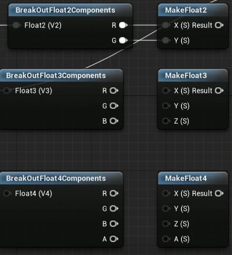
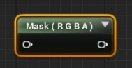
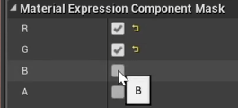
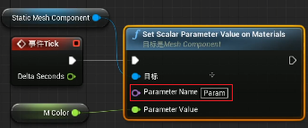
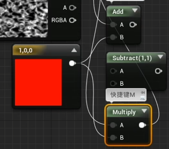
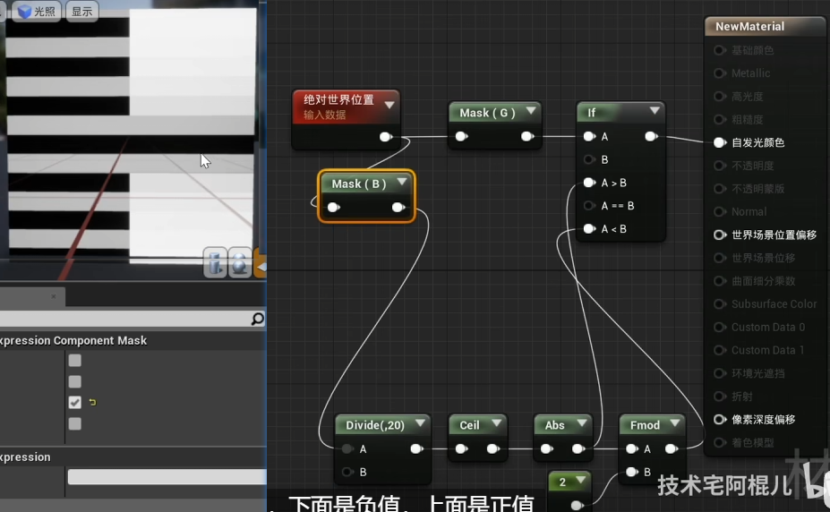
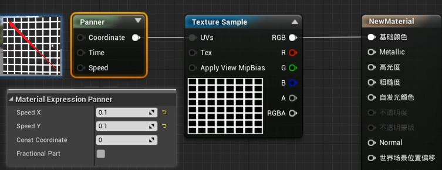
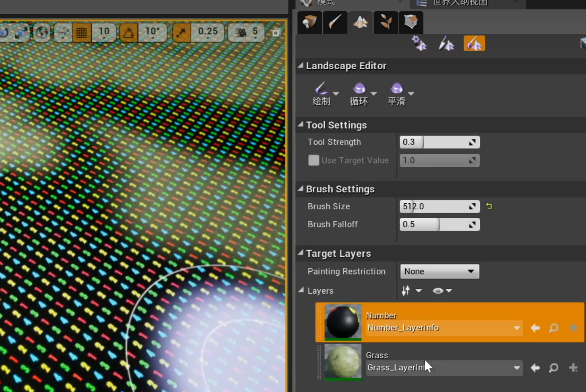

- 参考链接
	- [UE4 材质入门\_哔哩哔哩\_bilibili](https://www.bilibili.com/video/BV1GJ411j7d4/)

# 常见节点

## 材质输出节点

将黑白图片输出到透明度，实现模板功能

## 常数节点

结合之前鸟老师讲的材质蓝图生成 Shader，理解常数和参数的概念和区别

**常数是不能在运行时进行改变的**

### 四种基本常数节点
1 维度，2 维度，3 维度，4 维度，四种常数节点

### 操作节点

常数节点有一些基本的相应操作节点，比如取向量的分量，或者分量合并成向量

也可以利用 Mask 节点，选择要组合的节点（操作相当于上边蓝色节点的组合）

## 参数节点

可以利用参数名字进行设置

一般是创建材质实例，然后修改材质实例中的参数

## 数值运算节点

（不止这些节点）作用于向量，向量之间对应分量之间的运算

下边的实现思路：
- 左侧条带，本质是利用 Fmod 取模，在图中是在找偶数，所以左侧呈现黑白条带

## 向量运算节点

也就是真正执行向量计算的节点，而不是对应分量的计算

Dot，点积；Cross，叉乘

Append，可以拼接向量

新节点，**Panner**和**Rotator**，分别可以控制移动和旋转

## 数据节点

- 标量节点

## 实用数据节点

- Distance：计算两个点的欧拉距离
- Fresnel：菲涅尔节点
- If：选择节点

## 地形节点

- LayerBlend：定义两个图层
	- LayerNumber
	- LayerGrass

- LandscapeCoords：可以在节点中设置缩放、偏移等（基于纹理坐标）
- LayerSwitch：根据图层是否使用，选择性输出不同的数值，比如上边的地形节点有 number 和 grass 两个图层。
- LandscapeVisibilityMask：地形模板，可以透出底层

## 粒子节点

和 Niagara 系统结合使用，这一部分可以实现一些比较有趣的效果，可以多看看，链接->[粒子节点\_哔哩哔哩\_bilibili](https://www.bilibili.com/video/BV1GJ411j7d4?p=10&spm_id_from=pageDriver&vd_source=ec161869fed250aa616ee2fdd48e6494)

- ParticleRelativeTime
- ParticleSize
- ParticleColor
- ParticleMacroUV：有粒子的部分显示材质
- ParticleSubUV：每个粒子应用该材质

## 材质函数

材质中有两种节点：
- Expressions
- Functions：蓝色 banner，可以双击打开看到内部的逻辑设计，勾选上 ExposeToLibrary 才能被函数库搜索到，否则要将材质函数从资源浏览器中拖到材质蓝图中使用

## 通用金属材质

