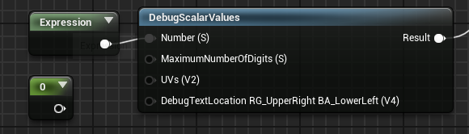
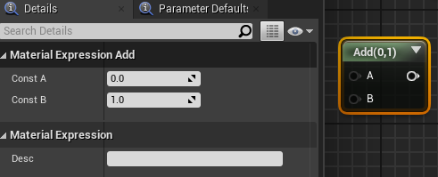
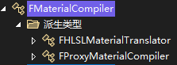
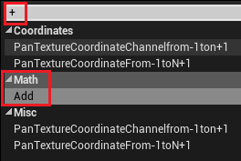
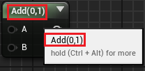
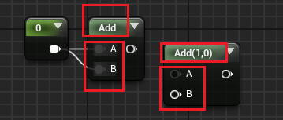

# 材质编辑器的节点

编辑器中节点如下：



- 节点 `0` 和节点 `Expression` 均为 `UMaterialExpression` 的子类

# UMaterialExpression

`UMaterialExpression` 也派生自 `UObject` 

```cpp
class ENGINE_API UMaterialExpression : public UObject
```

其中最重要的方法为 `Compile()`，在这里实现 Shader 的拼接逻辑（**注意这里的宏**）：

```cpp
#if WITH_EDITOR
/**
 * Create the new shader code chunk needed for the Abs expression
 *
 * @paramCompiler - UMaterial compiler that knows how to handle this expression.
 * @returnIndex to the new FMaterialCompiler::CodeChunk entry for this expression
 */
virtual int32 Compile(class FMaterialCompiler* Compiler, int32 OutputIndex) { return INDEX_NONE; }
#endif
```

这里以 `UMaterialExpressionAdd` 为例，分析实现一个材质节点所需要的属性和方法

## UMaterialExpressionAdd

编辑器中的 Add 节点：



源码版：

```cpp
UCLASS(MinimalAPI)
class UMaterialExpressionAdd : public UMaterialExpression
{
	GENERATED_UCLASS_BODY()
	
	UPROPERTY(meta = (RequiredInput = "false", ToolTip = "Defaults to 'ConstA' if not specified"))
	FExpressionInput A;
	
	UPROPERTY(meta = (RequiredInput = "false", ToolTip = "Defaults to 'ConstB' if not specified"))
	FExpressionInput B;
	
	/** only used if A is not hooked up */
	UPROPERTY(EditAnywhere, Category=MaterialExpressionAdd, meta=(OverridingInputProperty = "A"))
	float ConstA;
	
	/** only used if B is not hooked up */
	UPROPERTY(EditAnywhere, Category=MaterialExpressionAdd, meta=(OverridingInputProperty = "B"))
	float ConstB;
	
//~ Begin UMaterialExpression Interface
#if WITH_EDITOR
	virtual int32 Compile(class FMaterialCompiler* Compiler, int32 OutputIndex) override;
	virtual void GetCaption(TArray<FString>& OutCaptions) const override;
	virtual FText GetKeywords() const override {return FText::FromString(TEXT("+"));}
#endif // WITH_EDITOR
//~ End UMaterialExpression Interface
};
```

### 成员变量

#### 材质节点的输入

```cpp
UPROPERTY(meta = (RequiredInput = "false", ToolTip = "Defaults to 'ConstA' if not specified"))
FExpressionInput A;
```

- `RequiredInput = "false"` 表明该 Node 可以不接收输入

#### 材质节点的 Details

```cpp
/** only used if A is not hooked up */
UPROPERTY (EditAnywhere, Category=MaterialExpressionAdd, meta=(OverridingInputProperty = "A"))
Float ConstA;
```

- 位于左侧 Detail 面板中
- `meta=(OverridingInputProperty = "A")`：表明要覆写的输入

### 成员方法

```cpp
#if WITH_EDITOR
	virtual int32 Compile(class FMaterialCompiler* Compiler, int32 OutputIndex) override;
	virtual void GetCaption(TArray<FString>& OutCaptions) const override;
	virtual FText GetKeywords() const override {return FText::FromString(TEXT("+"));}
#endif // WITH_EDITOR
```

- 使用 `WITH_EDITOR` 表明在编辑器中使用
- 三个成员方法： `Compile` `GetCaption` `GetKeywords`

#### Compile()

这其中**最主要的方法为 `Compile`** 实现如下：

```cpp
#if WITH_EDITOR
int32 UMaterialExpressionAdd::Compile(class FMaterialCompiler* Compiler, int32 OutputIndex)
{
	// if the input is hooked up, use it, otherwise use the internal constant
	int32 Arg1 = A.GetTracedInput().Expression ? A.Compile(Compiler) : Compiler->Constant(ConstA);
	// if the input is hooked up, use it, otherwise use the internal constant
	int32 Arg2 = B.GetTracedInput().Expression ? B.Compile(Compiler) : Compiler->Constant(ConstB);
	
	return Compiler->Add(Arg1, Arg2);
}
#endif
```

代码的解释的很清楚了，这里简单总结：
- 使用 `FExpressionInput` 修饰接收输入的节点：可以在 `UPROPERTY` 中设置该节点的 meta 标签，比如上方代码中 A 和 B 都不要求必须输入，如果没有输入则使用对应的内部数值
- 在 `Compile` 中实现 Shader 的代码拼接逻辑，**实现拼接由 `FMaterialCompiler` 完成**：比如这里会判断节点是否有输入，有则使用，无则使用内部值

`FMaterialCompiler` 的两个派生如下：



#### GetKeywords()

- `GetKeywords()`：用于定义搜索节点时的 key



```cpp
#if WITH_EDITOR
virtual FText GetKeywords() const override {return FText::FromString(TEXT("+"));}
#endif
```


#### GetCaption()

- 用于自定义节点的显示，实现方式为字符串的拼接
- 这里的 A、B 都不要求必须接受输入，所以节点颜色偏灰，如果 `RequiredInput = "true"`，对应节点会变白



- 如果有输入，则不显示内容



```cpp
#if WITH_EDITOR
void UMaterialExpressionAdd::GetCaption(TArray<FString>& OutCaptions) const
{
	FString ret = TEXT("Add");
	
	FExpressionInput ATraced = A.GetTracedInput();
	FExpressionInput BTraced = B.GetTracedInput();
	if(!ATraced.Expression || !BTraced.Expression)
	{
		ret += TEXT("(");
		ret += ATraced.Expression ? TEXT(",") : FString::Printf( TEXT("%.4g,"), ConstA);
		ret += BTraced.Expression ? TEXT(")") : FString::Printf( TEXT("%.4g)"), ConstB);
	}
	
	OutCaptions.Add(ret);
}
#endif
```

# 参考链接
- [用 C++ 扩展一个 UE4 材质节点\_ue4 扩展材质 csdn-CSDN 博客](https://blog.csdn.net/u013412391/article/details/108655094)
	- 该文章最后实现了一个可变输入个数的材质节点，重载了：
		- `virtual const TArray<FExpressionInput*> GetInputs() override;`：根据 ValueCount 来决定输入的个数
		- `virtual void PostEditChangeProperty(FPropertyChangedEvent& PropertyChangedEvent) override;`：输入引脚数目发生变化后需要刷新一下节点的 UI
- 
