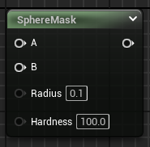
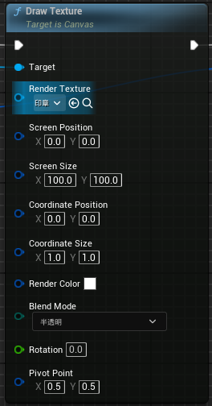

[教程地址](https://space.bilibili.com/148815144/channel/collectiondetail?sid=2641856&ctype=0)

效果示例：

大致思路：利用两层纹理，A 和 B，根据画笔经过位置将画布的纹理 B 修改位画笔引用的纹理 A
- A：画笔绘制的纹理
- B：画布的纹理

本文实现的效果：

---
# 得到画笔

## 基本原理

画笔实现：

效果如图：

将**混合模式**设置为**Additive**去掉纹理的黑色部分：

## 画笔的属性

一个画笔的属性可以分为：
- 画笔位置（图中对应传入 B 节点的二维向量 Position）
- 尺寸大小（图中对应 Radius）
- 硬度（图中对应 Hardness）

在这里提升为参数需要“右键点击->提升为参数”：

## 四维和二维，以及 ComponentMask

当位置信息被提升为变量之后，输出信息变为四维

而 **SphereMask** 需要的位置信息为二维，这里需要使用到 **ComponentMask**

---
# 得到画布

## 绘制到渲染目标 TextureRendererTarget

为了接收画笔的绘制效果，需要有一个画布进行储存，这里使用**渲染目标**

---
# 连接画笔和画布

## 准备工作

在新建的蓝图 Actor 类中，用下图节点，来实现画笔绘制到画布的逻辑：

这个节点接收一个动态材质，并绘制在目标上，所以我们需要在开始时创建一个动态材质并保存：

这个材质的创建就需要用到在“**得到画笔**”那一部分创建的材质，也因此这个材质可以进行设置其大小和硬度（也可以设置其他的参数）

这里创建一个自定义事件“CE_Draw”，画笔的大小这里暂时不进行设置：

为了在画布上绘制图像，自然需要知道画笔的每一个位置，这里可以使用物体的 UV 信息来作为画笔的位置，最后再绘制到渲染目标上即可

---
# 获取画笔位置

这里可以通过射线检测的方式来获取画笔映射到画布上的位置。

这里设置简单的情景，画布水平放置，画笔垂直画布向下，因此可以设置`Start`（画笔位置）和`End`（从画笔位置向下延伸一定距离）

另外我们也可以将`ObjectTypes`和`ActorsToIgnore`节点进行`MakeArray`，来设置想要检测的目标和想要忽略的目标：

最后判断是否检测到画布，并获取碰撞位置的 UV 信息，最终传递给绘制事件进行绘制：

**这里需要注意**：获取碰撞位置 UV，需要在“**项目设置**”中的“**物理->优化->（勾选）支持撞击结果的 UV**”，重启编辑器才能正常获得

绘制效果：

---
# 在物体上绘制

之前我们所谓设置的画布，其实是一个遮罩，也就是上边效果图中下方的渲染目标`RT_DrawCanvas`，结合`Lerp`节点，可以很轻松的在两个纹理之间进行涂抹。

---
# 总结

一些简单的功能结合起来，能够实现很复杂的效果。对于刚起步的我来说，什么看起来都很神秘，学的越多，不会的就越多，不会的越多，学的就越多，所以~~学的越多，学的越多~~。

---

# 自定义画笔样式：`Begin/End Draw Canvas to Render Target`

下面尝试修改画笔样式，准备图片如下：

之前画笔绘制的策略是，给画笔生成一个动态材质，将这个材质绘制到渲染目标上。

现在需要将目标纹理绘制到渲染目标上，

注意最后要连接节点**结束绘制画布到渲染目标**

从`Canvas`节点调用`DrawTexture`，选择画笔样式

**注意这里**：如果选用的目标图片没有通道，需要在下边`BlendMode`选择`Additive`可叠加，从而去掉黑色部分

这里先这样，将该自定义事件替换之前设置好的`Draw`

通过修改`ScreenPosition`来改变其在画布上的位置

**这里要注意：该事件会从画笔的碰撞位置获取 UV 信息，而 UV 信息是 0~1 之间的，所以在这里要根据画布的分辨率进行调整**，如下图所示

此时运行会发现：

我们设置的图片位置发生偏移，原因是图片的中心（或者说纹理坐标原点）位于图片的左上角。

因此，这里还需要再减去画笔样式图片的一半

此时再次运行发现效果正确：

---
# 案例复刻

- 清理花园
- 地形画画（虚拟纹理）
- 平面画画（置换效果）
