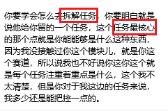

- 个人心态

- 个人能力培养
	- 沟通：60% ~ 70%
	- 任务拆解（分析问题的能力）：10%~20%
	- 代码能力：5%~10%

- 一个人的经验丰富：
	- 快速意识到任务的核心点
	- 尽可能压缩开发周期（）

- 更深层的提升，在快速变现的基础上
	- 长期维护，解决一些实际问题
		- 运行效率
		- 高并发
		- 紧急方案、预备方案
		- 拉闸相应
		- 用户体验

- 未来发展的思考

- 现在最该去做的事情：**总结，进行一个时间上的积累与沉淀，摒弃填鸭式的成长，多自我反思，自我总结**

