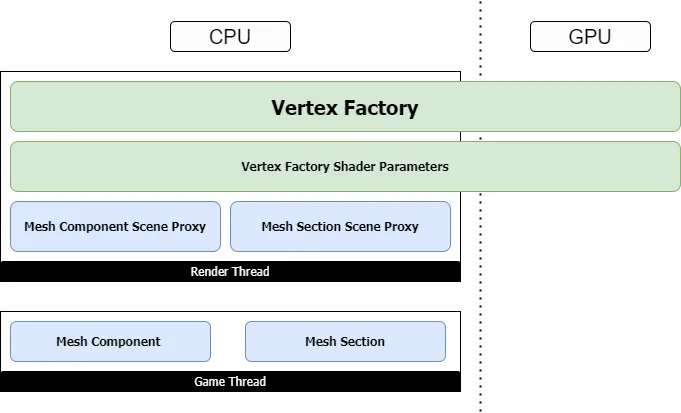
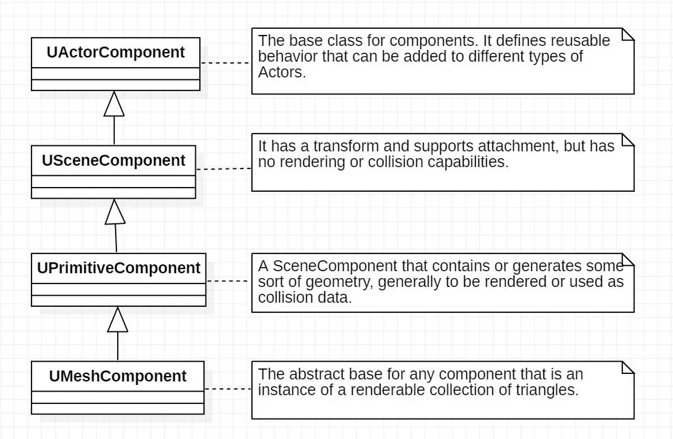

# UE 渲染总览

# UE 的 Component

- UActorComponent
- USceneComponent
	- **主要作用：提供 Transform，支持 Attachment，但没有 Rendering 和 Collision 的能力**
	- 场景用于承载 Actor，Actor 在场景内的位置信息通过其 RootComponent 实现，这个 RootComponent 是一个 SceneComponent，也就是提供了这个 Actor 的 Transform 信息，所以有能被放入场景的 Actor 也有不能被放入场景的 Actor
- UPrimitiveComponent
	- 对于能放入场景的 Actor，**真正提供能够被渲染的能力的是 `UPrimitiveComponent`**
	- **但渲染逻辑需要借助代理实现**
	- 这个代理的生成方法是由 `UPrimitiveComponent` 提供的：`CreateSceneProxy()`，但 UPrimitiveComponent 本身是一个虚基类，不可被实例化，所以该函数需要在子类中实现
- UMeshComponents
	-  `UMeshComponent` 作为 `UActorComponent` 的子类之一，并作为一些具有可渲染三角形集合的实例的抽象基类
	- 最常见的 MeshComponent 如：`UStaticMeshComponent`，负责渲染静态网格资源
- CustomMeshComponents
	- **创建 CustomMeshComponent 能够允许我们获取对 Mesh 的完全控制权**，主要有：
	- **VertexShader**：对每个顶点的完全控制，能够做到 material editor 无法做到的功能，例如将顶点分组应用不同的变换；或者在 `USkinnedMeshComponent` 或 `USplineMeshComponent` 中应用自定义的形变方式
	- **VertexShader 的输入参数与资源**：根据需要在 vs 中执行的逻辑，向内传递需要的参数和绑定所需要的资源
	- **控制 vertex buffer 和 vertex layout**：能够自定义顶点布局中所需要的元素，从而最小化顶点 buffer 所占用的内存空间，或者添加额外的属性
	- **几何预处理（geometry preprocessing）**：可以在使用前预处理 Mesh，即可在 CPU 上执行，也可以利用委托绑定到 GPU 上的一个 compute shader 上

# 参考链接

- [Creating a Custom Mesh Component in UE4 | Part 0: Intro | by khammassi ayoub | Realities.io | Medium](https://medium.com/realities-io/creating-a-custom-mesh-component-in-ue4-part-0-intro-2c762c5f0cd6)
