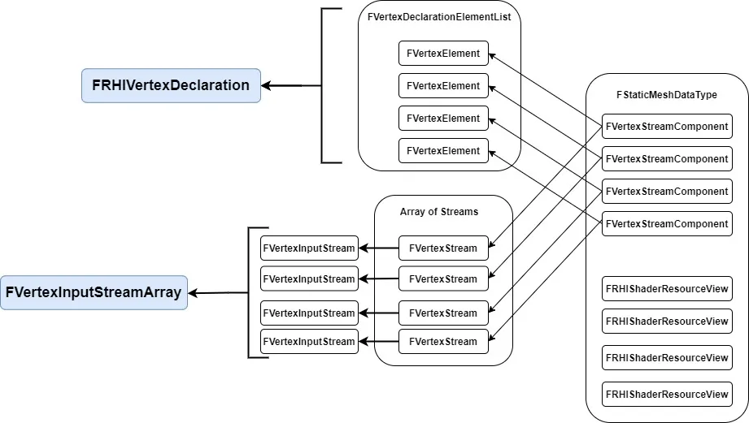

# 阅读目标

- 什么是 VertexFactory？VertexFactory 的作用？
- VertexFactory 如何创建资源？在哪里？需要什么？用到了什么？
- 如何链接到 Shader？Shader 的编译？


---
# 几个需要提前知道的知识

## RHI

RHI：Rendering Hardware Interface，是一层对底层图形 API 的抽象层。每个引擎有自己专门的一个对底层图形 API 调用的抽象封装，在 UE 里这一层叫做 RHI

目的是隐藏不同平台的不同图形 API 的调用差异，经过这一层的封装提供统一的调用接口

## FRenderResource 和 FRHIResource

在 UE 的 rendering code 中有两个重要概念：FRenderResource 和 FRHIResource。

`FRHIResource`：是 RHI 层资源的基类，它包含一个可渲染资源的相关数据，比如顶点 buffer，索引 buffer 等等

`FRenderResource`：是定义了可渲染资源的通用行为模式的接口，存在于渲染模块，是我们能够直接交互和创建的资源。它提供创建和封装 `FRHIResource` 的功能，提供了初始化和释放 RHI 资源的方法


---
# VertexFactory

## 什么是 Vertex Factory？它用来做什么？

VertexFactory 是存在于渲染线程的，用于传递特定 Mesh 类型的顶点数据的一种 `FRenderResource`，所以 VertexFactory 也会有一个在 RHI 线程上的代理

```cpp
// '\Engine\Source\Runtime\RenderCore\Public\VertexFactory.h'
class RENDERCORE_API FVertexFactory : public FRenderResource
```

一个最常见的 vertexfactory 为：`LocalVertexFactory`

## VertexFactory 接收什么？输出什么？

- 接收特定类型的数据：`FStaticMeshDataType`，输出数据： `FVertexInputStreamArray` 和 `FRHIVertexDeclaration`
- 最后用来利用 `FRHIVertexDeclaration` 创建对应的 VertexFactoryShader 并将 `FVertexInputStreamArray` 传递给 VertexFactoryShader



上图展示了 VF 接收的数据类型及其内部内容，最终会输出一个 `FRHIVertexDeclaration` 和一个 `FVertexInputStreamArray`

### 需要的输入类型：FStaticMeshDataType

#### 作用

- 作为 VF 初始化 RHI 资源时所需数据的容器类

#### 源码

```cpp
// \Engine\Source\Runtime\Engine\Public\Components.h
struct FStaticMeshDataType
{
	/** The stream to read the vertex position from. */
	FVertexStreamComponent PositionComponent;
	
	/** The streams to read the tangent basis from. */
	FVertexStreamComponent TangentBasisComponents[2];
	
	/** The streams to read the texture coordinates from. */
	TArray<FVertexStreamComponent, TFixedAllocator<MAX_STATIC_TEXCOORDS / 2> > TextureCoordinates;
	
	/** The stream to read the shadow map texture coordinates from. */
	FVertexStreamComponent LightMapCoordinateComponent;
	
	/** The stream to read the vertex color from. */
	FVertexStreamComponent ColorComponent;
	
	FRHIShaderResourceView* PositionComponentSRV = nullptr;
	
	FRHIShaderResourceView* TangentsSRV = nullptr;
	
	/** A SRV to manually bind and load TextureCoordinates in the Vertexshader. */
	FRHIShaderResourceView* TextureCoordinatesSRV = nullptr;
	
	/** A SRV to manually bind and load Colors in the Vertexshader. */
	FRHIShaderResourceView* ColorComponentsSRV = nullptr;
	
	int LightMapCoordinateIndex = -1;
	int NumTexCoords = -1;
	uint32 ColorIndexMask = ~0u;
	uint32 LODLightmapDataIndex = 0;
};
```

#### 适合 LocalVertexFactory 的输入数据

在 LocalVertexFactory 中，接收一个 `FDataType` 类型的数据

```cpp
// \Engine\Source\Runtime\Engine\Public\LocalVertexFactory.h
FDataType Data;
```

这个类型其实也是 `FStaticMeshDataType` 只不过多加了一个用于蒙皮网格的 SRV 指针：

```cpp
struct FDataType : public FStaticMeshDataType
{
	FRHIShaderResourceView* PreSkinPositionComponentSRV = nullptr;
};
```

### 输入类型内部：FVertexStreamComponent

在 `FStaticMeshDataType` 或 `FDataType` 中最重要的成员就是：`FVertexStreamComponent`

#### 作用

从下方源码也可以看出，这个类型中存储着**顶点缓冲**以及**其内部属性布局**，在 UE 中顶点属性（位置、纹理坐标等）不会在 VertexBuffer 中交错布置（Interleave）

> 关于是否交错布置可以参考：[Storing vertex data: To interleave or not to interleave? | Anteru's Blog](https://anteru.net/blog/2016/storing-vertex-data-to-interleave-or-not-to-interleave/)
> 总之这篇文章作者从三个方面对比了两种布局方式的优缺点：磁盘存储（压缩方式、读取性能）、内存（不同算法对布局有不同要求）、GPU 渲染（主要和带宽相关）
> 作者本人**认为非交错布局在渲染方面的优势盖过了在其他两个方面的劣势**。

UE 采取的就是非交错布局，即每一个 stream 负责储存顶点数据的一个属性，这些 stream 的区别在于它们在哪里使用和如何使用的。

#### 源码

```cpp
// \Engine\Source\Runtime\RenderCore\Public\VertexFactory.h
/**
 * A typed data source for a vertex factory which streams data from a vertex buffer.
 */
struct FVertexStreamComponent
{
	/** The vertex buffer to stream data from.  If null, no data can be read from this stream. */
	const FVertexBuffer* VertexBuffer = nullptr;
	
	/** The offset to the start of the vertex buffer fetch. */
	uint32 StreamOffset = 0;
	
	/** The offset of the data, relative to the beginning of each element in the vertex buffer. */
	uint8 Offset = 0;
	
	/** The stride of the data. */
	uint8 Stride = 0;
	
	/** The type of the data read from this stream. */
	TEnumAsByte<EVertexElementType> Type = VET_None;
	
	EVertexStreamUsage VertexStreamUsage = EVertexStreamUsage::Default;

	// 下边是三个构造函数
	// ...
};
```

#### FVertexBuffer

`FVertexBuffer` 也是一种 `FRenderSource`，所以相应的它也会有一个 RHI 侧的对应资源：`FRHIVertexBuffer`，以及相应的 RHI 资源的释放方法：`virtual void ReleaseRHI() override`
```cpp
// \Engine\Source\Runtime\RenderCore\Public\RenderResource.h
Class RENDERCORE_API FVertexBuffer : public FRenderResource
```


### 需要的输出类型：FRHIVertexDeclaration

- 描述了顶点的布局

#### FVertexElement

存储这个 VertexStream 中除了 VertexBuffer 之外的信息，用来在 VertexDeclaration 中创建相应的 entry

```cpp
// \Engine\Source\Runtime\RHI\Public\RHI.h
struct FVertexElement
{
uint8 StreamIndex;
uint8 Offset;
TEnumAsByte<EVertexElementType> Type;
uint8 AttributeIndex;
uint16 Stride;
//...
}
```

`EVertexElementType` 是元素格式的枚举类型

#### FVertexDeclarationElementList

如名，是 `FVertexElement` 的一个 Array

#### FRHIVertexDeclaration

- 作为输入布局（InputLayout）在 RHI 侧的相应 RHIResource，描述了顶点数据可能携带的不同属性：位置、法线、切线等

```cpp
// \Engine\Source\Runtime\RHI\Public\RHIResources.h
typedef TArray<struct FVertexElement,TFixedAllocator<MaxVertexElementCount> > FVertexDeclarationElementList;
class FRHIVertexDeclaration : public FRHIResource
{
public:
	virtual bool GetInitializer(FVertexDeclarationElementList& Init) { return false; }
};
```

- 创建方式：FVertexFactory::InitDeclaration

```cpp
// \Engine\Source\Runtime\RenderCore\Public\VertexFactory.h
void FVertexFactory::InitDeclaration(const FVertexDeclarationElementList& Elements, EVertexInputStreamType StreamType)
{
	if (StreamType == EVertexInputStreamType::PositionOnly)
	{
		PositionDeclaration = PipelineStateCache::GetOrCreateVertexDeclaration(Elements);
	}
	else if (StreamType == EVertexInputStreamType::PositionAndNormalOnly)
	{
		PositionAndNormalDeclaration = PipelineStateCache::GetOrCreateVertexDeclaration(Elements);
	}
	else // (StreamType == EVertexInputStreamType::Default)
	{
		// Create the vertex declaration for rendering the factory normally.
		Declaration = PipelineStateCache::GetOrCreateVertexDeclaration(Elements);
	}
}
```

输入类型：
```cpp
enum class EVertexInputStreamType : uint8
{
	Default = 0,
	PositionOnly,
	PositionAndNormalOnly
};
```

这三种 Declaration 类型如下：

```cpp
// RHIResource.h
typedef TRefCountPtr<FRHIVertexDeclaration> FVertexDeclarationRHIRef;
```

```cpp
// FVertexFactory.h

/** The RHI vertex declaration used to render the factory normally. */
FVertexDeclarationRHIRef Declaration;
/** The RHI vertex declaration used to render the factory during depth only passes. */
FVertexDeclarationRHIRef PositionDeclaration;
FVertexDeclarationRHIRef PositionAndNormalDeclaration;
```

可以看到区别在于前者用主渲染 pass，后两个是用于特定的 pass 比如深度 pass


输入类型不同，但都使用 `PipelineStateCache::GetOrCreateVertexDeclaration(Elements);` 创建顶点声明的缓存，这样可以复用具有相同元素和类型的顶点声明

```cpp
FRHIVertexDeclaration*	PipelineStateCache::GetOrCreateVertexDeclaration(const FVertexDeclarationElementList& Elements)
{
	// Actual locking/contention time should be close to unmeasurable
	FScopeLock ScopeLock(&GVertexDeclarationLock);
	uint32 Key = FCrc::MemCrc_DEPRECATED(Elements.GetData(), Elements.Num() * sizeof(FVertexElement));
	FRHIVertexDeclaration** Found = GVertexDeclarationCache.Find(Key);
	if (Found)
	{
		return *Found;
	}

	FVertexDeclarationRHIRef NewDeclaration = RHICreateVertexDeclaration(Elements);
	
	// Add an extra reference so we don't have TRefCountPtr in the maps
	NewDeclaration->AddRef();
	GVertexDeclarationCache.Add(Key, NewDeclaration);
	return NewDeclaration;
}
```

可以看到，在函数内部会首先去查找是否已经缓存过 `FRHIVertexDeclaration** Found = GVertexDeclarationCache.Find(Key);`

### 需要的输出类型：FVertexInputStreamArray

- 描述了顶点的数据流

#### FVertexStream

- 用来保存创建顶点流（vertex stream）的相关数据的结构体

```cpp
// VertexFactory.h
struct FVertexStream
{
const FVertexBuffer* VertexBuffer = nullptr;
uint32 Offset = 0;
uint16 Stride = 0;
EVertexStreamUsage VertexStreamUsage = EVertexStreamUsage::Default;
uint8 Padding = 0;
// ...
}
```

- 和 FVertexDeclaractionRHIRef 一样，FVertexStream 也有三种：

```cpp
// VertexFactory.h
protected:
	/** The vertex streams used to render the factory. */
	TArray<FVertexStream,TInlineAllocator<8> > Streams;

//...

private:

	/** The position only vertex stream used to render the factory during depth only passes. */
	TArray<FVertexStream,TInlineAllocator<2> > PositionStream;
	TArray<FVertexStream, TInlineAllocator<3> > PositionAndNormalStream;

	/** The RHI vertex declaration used to render the factory normally. */
	FVertexDeclarationRHIRef Declaration;
	
	/** The RHI vertex declaration used to render the factory during depth only passes. */
	FVertexDeclarationRHIRef PositionDeclaration;
	FVertexDeclarationRHIRef PositionAndNormalDeclaration;
```

#### FVertexInputStream

- 和 FVertexStream 不同，这里的顶点 buffer 为 `FRHIVertexBuffer`，渲染器会调用 `FVertexFactory::GetStreams()` 来获取 `FVertexInputStream` 数组，会根据要求的顶点流类型创建对应的顶点输出流

```cpp
struct FVertexInputStream
{
uint32 StreamIndex : 4;
uint32 Offset : 28;
FRHIVertexBuffer* VertexBuffer;
// ...
};
```


## VertexFactoryShader

### Vertex Factory Shader Permutations

UE 使用基于模板的方法来生成对应的 ShaderCode，所以 VertexFactoryShaderCode 内部没有定义 VertexShader 也没有入口点，VertexFactoryShader 的文件后缀为 `.ush` 而不是 `.usf` 就是这个原因，表示这些只是包含着一系列定义的 Shader 的头文件，是生成最终 Shader 文件 `.usf` 的模板
- 好处是：模块化和代码复用，不需要给每个 VertexFactory 重新编写 VertexShader
- 坏处是：需要编译大量 Shader，因为要考虑各种 Shader 的模板并生成对应的 ShaderCode，这涉及到 ShaderPermutations

但也可以让引擎只编译需要的 VertexFactoryShader，通过 `ShouldCompilePermutations()` ，接收一个 `FVertexFactoryShaderPermutationsParameters` 参数，这个参数里包含了材质和平台信息，并据此判断是否编译

### 引擎如何知道哪个 VertexFactory 用哪个 ush：The Vertex Factory Macros

```cpp
DECLARE_VERTEX_FACTORY_TYPE
```


---
# 参考链接
- [Creating a Custom Mesh Component in UE4 | Part 1: An In-depth Explanation of Vertex Factories | by khammassi ayoub | Realities.io | Medium](https://medium.com/realities-io/creating-a-custom-mesh-component-in-ue4-part-1-an-in-depth-explanation-of-vertex-factories-4a6fd9fd58f2)

