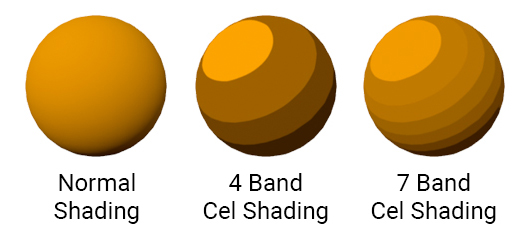
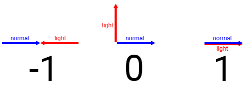
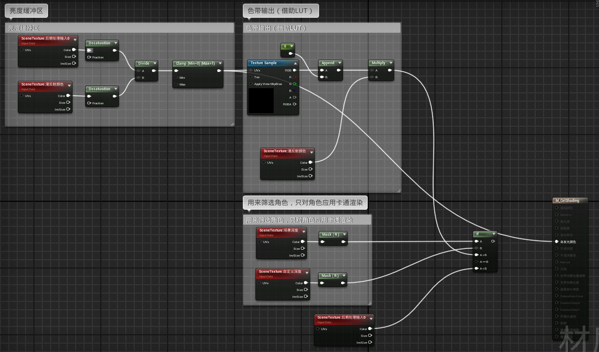

# 笔记总结

**卡通渲染**：使用多个色带来渲染物体，不使用连续过渡的色彩。

**卡通渲染的原理**：最常用的方法是比较表面方向（也就是法线方向）和光线方向。通过计算法线和光线方向之间的**点积**，或表面的亮度，通过设置**阈值**来分离多个色带

**卡通渲染着色器**：这里用后期处理的手段实现卡通渲染

- 新建材质域为后期处理的材质
- 计算亮度缓冲（借助 SceneTexture 分别选择后期处理输入和漫反射计算亮度缓冲，需要注意 desaturation 和 clamp）
- 建立 LUT（注意设置取消 sRGB 颜色空间，以及 XY 平铺为限制），根据亮度缓冲获取对应色带（这里起到系数的作用）
- 将色带和漫反射颜色相乘并输出

**指定物体渲染**：利用自定义，可以选择对应物体在细节面板中：“渲染->渲染自定义深度通道”
- 在上方的材质中利用自定义深度和场景深度（利用 SceneTexture 获取），比较深度信息
- 针对选定物体和其他物体输出不同渲染效果

# 一些概念

- `SceneTexture`，后期处理输入 0，漫反射颜色，场景深度，自定义深度
- `Desaturation`：将颜色从彩色转为灰度（褪色效果），计算原理：$Gray=0.3 \times R + 0.59 \times G + 0.11 \times B$，系数选择依据为人眼对不同颜色的敏感度，保证视觉上的自然
- **后期处理输入**：完成光照和渲染后，图像会被存储在这里，如果没有其他处理的话，这里将是最终展示的效果
- **漫反射颜色**：无灯光和后处理的效果，只有物体的漫反射颜色
- **后期处理体积**：在细节面板中的后期处理材质设置需要应用的后期处理材质（对应材质要在“材质域”中设置为“后期处理”）
- **色调映射**（ToneMapping）：可以在后期处理的细节面板中设置“可混合位置->色调映射后”
- **自定义深度**（Custom Depth）：和场景深度缓冲一样，存储了深度信息。但自定义深度存储的是指定网格的深度信息，指定网格要在对应网格体的“渲染->渲染自定义深度通道”处勾选，这样 SceneTexture 中也可以选择自定义深度
- **LUT**（查找表，LookUpTable）: 注意此时要使用 LUT 进行数学运算，所以要取消勾选 sRGB，防止颜色空间转换；以及设置 xy 的平铺法为限制，防止采样边缘时将另一侧也混合

---
# 参考连接
-  [虚幻 4 卡通渲染（Cel-Shading）教程（翻译）](https://zd304.github.io/2021/11/14/UE4-Cel-Shading-Tutorial-1/)

