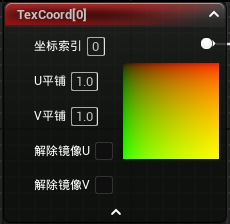

# UE 的渲染总览

## UE 的几个重要线程

- 游戏线程（Game Thread）（主要工作）
  - UE 在 Windows 下的入口`WinMain`函数，位于`LaunchWindows.cpp`文件中，主要工作是初始化，随后会启动`EngineLoop`
  - 大部分逻辑都在这里写，比如创建一个 Actor 等
  - 会包装一些命令发送到渲染线程，在渲染线程时才会真正执行

- 渲染线程（Render Thread）（主要工作）
  - 收集要渲染的批次（Batch）（找出哪些东西需要渲染，也就是可见性）
  - 对可见的物体来生成并记录渲染命令，例如不同 Actor 需要绑定哪个 shader 等等（此时命令还没有真正执行，只是记录）
  - 往 RHI 线程发送命令

- RHI 线程（RHI Thread）
  - 主要工作，负责将这些渲染命令分发到 GPU 上
  - UE 的一个旧版本中没有这个线程，之后才添加的
  - RHI 线程的意义：当渲染线程确定可见物体并生成渲染命令结束后只需要将命令分发即可，此时已经能够开始进行下一帧的收集了，而不是等到分发完毕后再开始（**并且分发渲染命令，即从 CPU 到 GPU 的过程是很耗时间的**），于是独立出一个线程来专门负责 渲染命令的分发
- GPU 收到 RHI 线程发来的渲染命令进行渲染

## 从游戏线程发送渲染命令到渲染线程的示例

```cpp
PRAGMA_DISABLE_OPTIMIZATION // 可能会被优化无法正常打断点，所以这里关闭一下
/* 在一个 ATestCharacter 类的 Cpp 文件中（需要添加 RenderCore 的依赖） */
void ATestCharacter::Tick(float DeltaSeconds)
{
    Super::Tick(DeltaSeconds);
    // 发送命令到渲染线程
    ENQUEUE_RENDER_COMMAND(FTestCmd)([](FRHICommandList& RHICmdList)->void
    {
        UE_LOG(LogTmp, Log, TEXT("Render Thread"));
    });
}
PRAGMA_ENABLE_OPTIMIZATION // 记得重新打开
```

---
# Material 的 ShaderCode 和 PBR 简述

UE 中的材质的作用是最终生成的 ShaderCode 的生成模板，材质实例则是共用材质图表的逻辑，并暴露出图表中作为 param 的接口，最终生成的 ShaderCode 可能不同

(这里只考虑直接光照)

无论是直接光照还是间接光照，都可以分为两个部分：漫反射 + 镜面反射

漫反射和镜面反射怎么理解？
- 光照到物体表面，一部分直接被反射（镜面反射部分），一部分会进入物体内部（散射）
- 进入物体内部的部分
	- 部分光经过与物体内部粒子相互作用后又从入射的表面一侧射出，根据射出的位置和光照射的位置的距离
		- 距离很近，可以认为是同一个位置，这部分为**漫反射**
		- 距离比较远，这部分是**次表面反射**

对于 PBR 的漫反射部分，和 Blinn-Phong 模型的计算差不多，都是依据入射光和表面发现的夹角

对于镜面反射，PBR 则考虑了表面的法线分布函数、几何函数、菲涅尔函数等

如何理解这三个函数？
- 法线分布函数
	- 因为表面粗糙度（表面法线的方向分布）的影响，光线被反射到各个方向的概率分布
- 几何函数
	- 发生镜面反射的这一部分光，有多大的概率被表面附近的其他微表面遮挡住
- 菲涅尔函数
	- 反射光线有多少比例分布在观察的角度上


---

# 游戏的框架概述

游戏由一个个对象组成，通过 UObject 提供底层的内存管理功能，接着派生子类添加能够被放入场景的功能、能被渲染的功能等等

在 UE 中，最终看到的渲染结果位于视口/Camera 中，但这个 Camera 并不具有渲染的能力，它只是作为提供渲染所需要的 View 信息，比如 FOV、宽高比、视锥体远近平面等。如果向场景中添加多个 Camera，也只是给视口提供了相关参数。

但有一个 `SceneCapture2D` 本身具有渲染的能力，如果附加了一个 RenderTarget，再进行比如每帧渲染的设置，就会不断进行渲染


---
# 材质蓝图

- UE 中材质的本质：**Shader 的生成模板**

在材质蓝图中连接好的逻辑，会基于一个模板 Shader 头文件（`MaterialTemplate.ush`）生成对应的 HLSL Code（和材质实例可以复用的逻辑部分），并生成一个虚拟路径。其他用于生成 Shader 的模板头文件会包含该路径，以该材质蓝图的节点逻辑来实例各种版本（不同 Usage 和不同渲染 Pass）的 Shader

```cpp
// MObileBasePassVertexShader.usf
// 生成的虚拟路径
#include "/Engine/Generated/Material.ush"
#include "/Engine/Generated/VertexFactory.ush"
```

材质实例中修改某些参数也会导致生成不同的 Shader 
- **单纯修改 Param 相关的参数不会生成不同的 Shader**，因为这个 Param 是 UniformBuffer，对于 Shader 来说这个参数是常量，但对于（驱动层或 CPU 上执行的 C++ 程序等）外部是可以修改的
- 但修改属于材质本身属性的数据（比如**静态开关**）会导致生成不同的 Shader
- 修改材质本身的一些设置也会导致生成不同的 Shader

## 细节面板：Usage

面板位置：

Usage Flag 用于标记 Material 的用途（需要材质域选择表面），编译器会针对每一个用途生成对应的 Shader 代码（部分 Flag 可能会共享同一份），默认情况下会自动对应的 Usage Flag

一般推荐取消勾选“编辑器中自动设置使用”

### 参考链接

- [官方文档：Material Properties-Usage](https://docs.unrealengine.com/4.27/en-US/RenderingAndGraphics/Materials/MaterialProperties/)
- [Optimizing Shaders in Unreal Engine](https://calvinatorrtech.art.blog/2023/12/20/optimizing-shaders-in-unreal-engine/#usage-flags)


---
## 查看 ShaderCode

查看从材质生成的 ShaderCode

在编辑器内：窗口->着色器代码->选择对应平台查看；如果要查看本地或最终的 usf 代码，可以在**引擎目录**中打开：`Engine\Config\ConsoleVariables.ini`，对前两个命令 `;r.ShaderDevelopmentMode=1` 和 `;r.DumpShaderDebugInfo=1` 取消注释（删除;），此时可以在**项目目录**中的 `\Saved\ShaderDebugInfo\` 中看到对应平台的 ShaderCode

### 参考链接

- [ue4 查看编译后 Shader 文件](https://www.engineworld.cn/forum.php?mod=viewthread&tid=3803)

---
## 材质蓝图节点

蓝图节点的公共基类： `UMaterialExpression`，文件路径：`\Engine\Source\Runtime\Engine\Classes\Materials\MaterialExpression.h` 

该基类内部主要用 `#if WITH_EDITORONLY_DATA` 宏来设置静态分支，用于定义和 Editor 相关的内容。具体功能由其基类实现

### 以 UMaterialExpressionConstant 为例

```cpp
UCLASS(collapsecategories, hidecategories=Object, MinimalAPI)
class UMaterialExpressionConstant : public UMaterialExpression
{
	GENERATED_UCLASS_BODY()
	
	UPROPERTY(EditAnywhere, BlueprintReadWrite, Category=MaterialExpressionConstant, DisplayName="Value")
	float R;
	
	
	//~ Begin UMaterialExpression Interface
	#if WITH_EDITOR
		virtual int32 Compile(class FMaterialCompiler* Compiler, int32 OutputIndex) override;
		virtual void GetCaption(TArray<FString>& OutCaptions) const override;
		virtual FString GetDescription() const override;
	#endif // WITH_EDITOR
	
	//~ End UMaterialExpression Interface
};
```

在材质蓝图中的节点如下图，这里的传入值和就是代码中的 `float R`：


该派生类通过 `Compiler()` 方法编译为材质蓝图的节点，**最终会返回节点的索引 ID**

```cpp
#if WITH_EDITOR
int32 UMaterialExpressionConstant::Compile(class FMaterialCompiler* Compiler, int32 OutputIndex)
{
	return Compiler->Constant(R);
}
#endif // WITH_EDITOR
```

## 材质结果节点


该节点在 `MaterialTemplate.ush` 中定义，
```cpp
half3 GetMaterialEmissiveForCS(FMaterialPixelParameters Parameters)
{
%s;
}
```

每个输出节点都会有一个 `%s` 用于接收连接到该节点的逻辑，实现方式是通过调用 `Compiler()` 中的方法，如果有输入，以 ComponentMask 为例：`Compiler->ComponentMask(Input.Compile(Compiler), R, G, B, A);`，这里会有一个 Input 输入，也就相当于调用了输入到这个节点的节点的 Compiler，从而实现从输出反向查找输入的节点的索引的调用链

---
# 节点整理

## 节点：DebugFloat


## 节点：TexCoord

节点如下，快捷键为 `U + LeftCick`：



UV 坐标以左上角为原点，横向（红色）为 U，纵向（绿色）为 V

### 属性

#### 参数：U/V 平铺

分别对应 `UTiling` 和 `VTiling`，控制纹理在对应轴方向上的重复次数，影响纹理在模型表面的平铺效果

- 值为 1：纹理保持原尺寸，无平铺
- 值大于 1：纹理在对应轴上重复多次，实现平铺效果
- 值小于 1：纹理在对应轴上缩小

原理如下：


红色方块表示 `TexCoord` 的 UV 平铺属性，黄色圆圈表示我们要应用在模型表面的纹理

如果 UV 平铺保持为 1，那么纹理可以和 UV 坐标完美对应


如果值大于 1，这里以 2 为例，上图的红色方框应当变为如下：


即，在 U 方向上发生重复


如果值小于 1，以 0.5 为例，同理，红色区域的 U 方向被压缩，从而使得黄色纹理只能有一半处于红色区域内，直接看效果


#### 另一种 UV 计算

上边进行的平铺设置相当于让原本的 UV 数值乘上了一个系数，从而实现的缩放变化，这里通过节点实现纹理映射的左右移动。

实现如下连接：


这次修改这个位置，实现纹理在 U 轴上的平移效果


原理和之前差不多，只不过红色区域变成了这样：


#### 解除镜像

这里还没明白，待完成


#### 参考链接
- [【UE】Texture Coordinate 材质节点](https://blog.csdn.net/ChaoChao66666/article/details/132583607)


---
## 节点：SphereMask

- 参考链接：[【UE4】材质基础 (二)——Sphere Mask](https://zhuanlan.zhihu.com/p/87762783)


---


