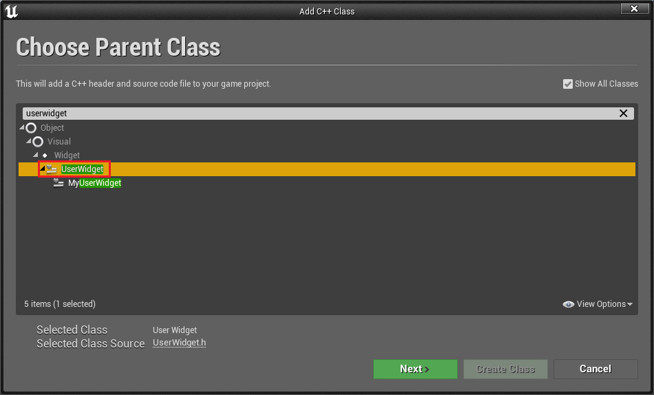
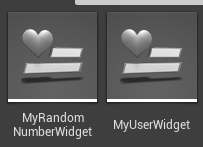
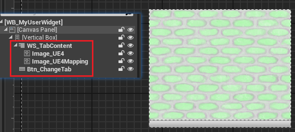
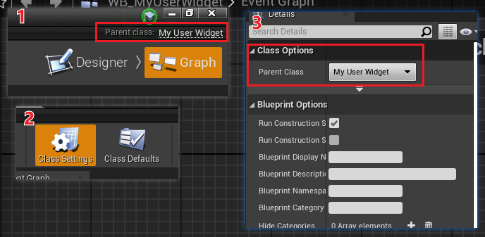
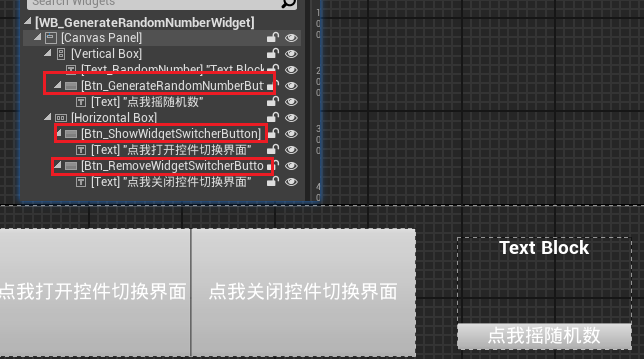
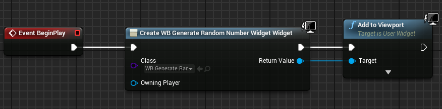

> UE 4.27 源码版本，VS 2022 17.9.6

先看看效果


暂时忽略控件布局，这里只注重控件功能的逻辑实现


本示例效果如果使用 BP 实现也不会特别麻烦，但是将核心的功能逻辑封装到 C++ 代码中，只把相关接口暴露给蓝图，对隐藏复杂的逻辑以及蓝图的调用都有好处，维护起来也比较方便（谁也不想在蓝图里看到盘丝洞吧）

总之，根据大佬们的经验，**把数据相关的逻辑放在 C++ 中实现，而把视觉逻辑放在蓝图中实现**，是目前最为推荐的做法。


# 第一步，创建 C++ 类

> 记得创建工程时选择 C++ 版本

选择 UserWidget 作为父类



创建两个：



- 左侧实现产生随机数的功能与创建另一个控件的功能
- 右侧为实现控件切换器功能


# 第二步，拥抱 C++

在 VS 中打开创建的 C++ 类

## 实现按钮图片切换

打开`MyUserWidget.h`：

```cpp
#pragma once

#include "CoreMinimal.h"               // 引擎的核心头文件
#include "Blueprint/UserWidget.h"      // 父类 UUserWidget 的头文件
#include "MyUserWidget.generated.h"    // 生成的反射文件

UCLASS()
class UE_LEARNSOURCECODE_API UMyUserWidget : public UUserWidget
{
	GENERATED_BODY()

	/* 重写 UMG 的生命周期方法 */
protected:
	virtual void NativeConstruct() override;
	virtual void NativeDestruct() override;
	virtual void NativeTick(const FGeometry& MyGeometry, float InDeltaTime) override;

	// UPROPERTY 中的 meta 设置为 bindwidget，UE 自动获取目标控件指针
	// 注意名称和蓝图对应控件要相同
private:
	UPROPERTY(Meta = (BindWidget)) // BindWidget 表示从继承此类的蓝图类中寻找相同名字的同类控件
	class UWidgetSwitcher* WS_TabContent;
	UPROPERTY(Meta = (BindWidget))
	class UImage* Image_UE4;
	UPROPERTY(Meta = (BindWidget))
	class UImage* Image_UE4Mapping;
	UPROPERTY(Meta = (BindWidget))
	class UButton* Btn_ChangeTab;
public:
/* 按钮的点击事件 */
	UFUNCTION(BlueprintCallable)
	void OnBtnClick_ChangeTab();
private:
	// Switcher 的当前页面索引
	int8 CurrWSIndex = 0;
};
```

在`MyUserWidget.cpp`中：

首先实现构建、销毁事件，由于这里不需要 Tick 所以暂时忽略

```cpp
void UMyUserWidget::NativeConstruct()
{
	Super::NativeConstruct();
	// 构造时绑定 Button 的点击事件
	if (Btn_ChangeTab)
	{
		Btn_ChangeTab->OnClicked.AddDynamic(this, &UMyUserWidget::OnBtnClick_ChangeTab);
	}
}

void UMyUserWidget::NativeDestruct()
{
	Super::NativeDestruct();
	// 销毁时要解绑
	if(Btn_ChangeTab)
	{
		Btn_ChangeTab->OnClicked.RemoveDynamic(this, &UMyUserWidget::OnBtnClick_ChangeTab);
	}
}
```

具体的点击事件实现：

```cpp
void UMyUserWidget::OnBtnClick_ChangeTab()
{
	switch (CurrWSIndex)
	{
	case 0:
		WS_TabContent->SetActiveWidgetIndex(1);
		CurrWSIndex = 1;
		break;
	case 1:
		WS_TabContent->SetActiveWidgetIndex(0);
		CurrWSIndex = 0;
		break;
	default:
		WS_TabContent->SetActiveWidgetIndex(0);
		break;
	}
}
```

主要逻辑就是按钮点击一次，根据当前的`CurrWSIndex`取值，切换到下一个取值


## 实现随机数生成

接下来切换到另一个控件`MyRandomNumberWidget.h`：

```cpp
#pragma once

#include "CoreMinimal.h"
#include "Blueprint/UserWidget.h"
#include "Components/Button.h"
#include "Components/TextBlock.h"
#include "MyRandomNumberWidget.generated.h"


UCLASS()
class UE_LEARNSOURCECODE_API UMyRandomNumberWidget : public UUserWidget
{
	GENERATED_BODY()
	
public:
	void NativeConstruct() override;
	void NativeDestruct() override;
protected:

/* 按钮切换 WidgetSwitcher */
	UPROPERTY(meta=(BindWidget))
	class UButton* Btn_GenerateRandomNumberButton;
	UPROPERTY(meta=(BindWidget))
	class UTextBlock* Text_RandomNumber;

	void GenerateRandomNumber(); // 按钮 Click 事件的具体实现逻辑

	UFUNCTION()
	void OnGenerateRandomNumberButtonClicked();

};
```

实现逻辑都是以按钮控件的 Click 事件为核心，触发随机数的生成并付给文本控件

`MyRandomNumberWidget.cpp`中的实现：

```cpp
/* 生成随机数的部分 */
void UMyRandomNumberWidget::GenerateRandomNumber()
{
	int32 RandomNumber = FMath::RandRange(0, 100);

	Text_RandomNumber->SetText(FText::AsNumber(RandomNumber));
}

void UMyRandomNumberWidget::OnGenerateRandomNumberButtonClicked()
{
	GenerateRandomNumber();
}
```

关于`NativeConstruct`和`NativeDestruct`实现和之前的控件相同，而本控件功能暂时没实现完毕，这里将二者实现放到最后给出

总之，如果此时将`OnGenerateRandomNumberButtonClicked()`绑定到按钮的点击事件上已经可以实现点击按钮产生随机数的效果了，接下来看另一个功能的实现


## 实现另一个控件的创建

在大部分情况下，UI 界面上的按钮点击后通常会创建一个新的界面以供用户使用，所以这里也尝试实现以下点击按钮创建另一个控件的功能

核心控件：分别负责创建和销毁的按钮控件

```cpp
/* 按钮创建/销毁另一个 Widget */
UPROPERTY(meta=(BindWidget))
class UButton* Btn_ShowWidgetSwitcherButton;
UPROPERTY(meta=(BindWidget))
class UButton* Btn_RemoveWidgetSwitcherButton;
```

记得还有需要绑定到按钮点击事件上的方法：

```cpp
// 按钮的具体效果
void CreateAnotherWidget();
void RemoveAnotherWidget();

// 按钮要绑定的
UFUNCTION()
void OnShowWidgetSwitcherButton();
UFUNCTION()
void OnRemoveWidgetSwitcherButton();
```

和之前的控件一样，要绑定的方法内部调用具体的实现

```cpp
void UMyRandomNumberWidget::OnShowWidgetSwitcherButton()
{
	CreateAnotherWidget();
}

void UMyRandomNumberWidget::OnRemoveWidgetSwitcherButton()
{
	RemoveAnotherWidget();
}
```

创建 Widget 的方式和在蓝图中类似，都是调用`CreateWidget()`和`AddToViewport()`

```cpp
/* 创建另一个 Widget 的部分 */
void UMyRandomNumberWidget::CreateAnotherWidget()
{
	if (!AnotherWidget) // 没有创建的时候才能创建，比在 BP 里舒服也简洁
	{
		/* 创建另一个 Widget 所需要的 */
		// 控件蓝图路径：在编辑器里右键蓝图选择复制引用路径
		FString AnotherWidgetClassLoadPath = FString(TEXT("/Game/_LearnUEC++/WB_MyUserWidget.WB_MyUserWidget_C")); // 注意末尾要加 _C
		// 加载类
		TSubclassOf<UUserWidget> AnotherWidgetClass = LoadClass<UUserWidget>(NULL, *AnotherWidgetClassLoadPath);

		AnotherWidget = CreateWidget(GetWorld(), AnotherWidgetClass);
		AnotherWidget->AddToViewport();
	}
}
/* 移除 widget */
void UMyRandomNumberWidget::RemoveAnotherWidget()
{
	if (AnotherWidget) // 有这个 widget 才去 remove
	{
		AnotherWidget->RemoveFromParent();
		AnotherWidget = nullptr; // 置空，防止裸指针
	}
}
```

参考链接：https://blog.csdn.net/qq_41487299/article/details/120368490


## 暂时收尾 C++

最后给出该控件的`NativeConstruct`和`NativeDestruct`

```cpp
void UMyRandomNumberWidget::NativeConstruct()
{
	Super::NativeConstruct();

	GenerateRandomNumber();

	/* 创建另一个 Widget 所需要的 */
	AnotherWidgetClassLoadPath = FString(TEXT("/Game/_LearnUEC++/WB_MyUserWidget.WB_MyUserWidget_C"));
	AnotherWidgetClass = LoadClass<UUserWidget>(NULL, *AnotherWidgetClassLoadPath);

	// AddUniqueDynamic 和 AddDynamic 的区别是什么呢
	Btn_GenerateRandomNumberButton->OnClicked.AddUniqueDynamic(this, &UMyRandomNumberWidget::OnGenerateRandomNumberButtonClicked);
	Btn_ShowWidgetSwitcherButton->OnClicked.AddUniqueDynamic(this, &UMyRandomNumberWidget::OnShowWidgetSwitcherButton);
	Btn_RemoveWidgetSwitcherButton->OnClicked.AddUniqueDynamic(this, &UMyRandomNumberWidget::OnRemoveWidgetSwitcherButton);
}

void UMyRandomNumberWidget::NativeDestruct()
{
	Super::NativeDestruct();

// 销毁时对控件事件解绑
	if (Btn_GenerateRandomNumberButton)
	{
		Btn_GenerateRandomNumberButton->OnClicked.RemoveDynamic(this, &UMyRandomNumberWidget::OnGenerateRandomNumberButtonClicked);
	}
	if (Btn_ShowWidgetSwitcherButton)
	{
		Btn_ShowWidgetSwitcherButton->OnClicked.RemoveDynamic(this, &UMyRandomNumberWidget::OnShowWidgetSwitcherButton);
	}
	if (Btn_RemoveWidgetSwitcherButton)
	{
		Btn_RemoveWidgetSwitcherButton->OnClicked.RemoveDynamic(this, &UMyRandomNumberWidget::OnRemoveWidgetSwitcherButton);
	}
}
```

# 第三步，编辑器内蓝图实现

创建 UserWidget 子类蓝图，在蓝图内设置如下图所以控件，并按照要求设置好布局



**这里要注意控件名称要和之前实现的 C++ 类中的一致**

接下来切换到`Graph`布局，按照下图顺序找到`ParentClass`选择之前创建的`MyUserWidget`类



点击编译，如果报错，记得检查一下控件名称是否一致或者是少了控件

另一个也是类似设置



注意这里我向控件上又分别附加了一些文本为了区分功能

# 第四步，运行

最后在关卡蓝图中创建控件



运行即可得到之前所示效果


# 知识点

- 类型相关
  - [UClass](../../学习笔记)
  - [TSubclassOf](../../学习笔记/UE源码相关/TSubclassOf.md)
  - [LoadClass<T>()](../../学习笔记/UE源码相关/动态加载：LoadClass和LoadObject.md)
- 数学模块
  - [FColor](../../学习笔记/UE源码相关/Math/FColor.md)
  - [FMath](../../学习笔记/UE源码相关/Math/FMath.md)
- 字符串相关
  - [FString](../../学习笔记/UE源码相关/字符串/FString.md)
  - [FText](../../学习笔记/UE源码相关/字符串/FText.md)
- 委托相关
  - [AddUniqueDynamic](../../学习笔记/UE源码相关/委托/AddDynamic和AddUniqueDynamic.md)
- 其他
  - [GetWorld()](../../U++学习/GetWorld().md)
  - [GEgine](../../学习笔记/UE源码相关/GEngine.md)


# 总结

之前在蓝图里为了实现逻辑各种连连看，一旦变量或节点开始变多，蓝图的直观性与可读性大大下降。

这次通过 C++ 实现功能逻辑，而利用蓝图实现视觉逻辑，确实是从思路和实现上清晰了不少

记得第一次在蓝图中实现控件创建 `widget` 的时候，多次点击会导致创建多个 `widget` 相互堆叠，`remove` 的时候还得点对应次数。

为了防止多次点击产生多个 `widget`，又是设置 `visibility` 又是加 `canvas` 直接挡住下层，又或者是对变量 `IsValid` 一下，但这样都会导致图表中节点变多易读性下降（或许有其他方式，可惜我不知道）

而 C++ 中，只需要检查一下变量是不是空指针

```cpp
void ButtonClicked()
{
	if(WidgetCreatedByClick == nullptr)
	{
		CreateWidget();
		...	
	}
}
```

虽然也是创建变量存储，但这样显然是逻辑上通顺的，在实现过程中就会自然想到这个指针是不是空的，空的该怎么办，不空怎么办，并且自带简洁与可读性的。

后续计划，尝试隔一段时间实现一些小功能，作为小项目记录下来，通过项目来学习其中使用到的东西。


