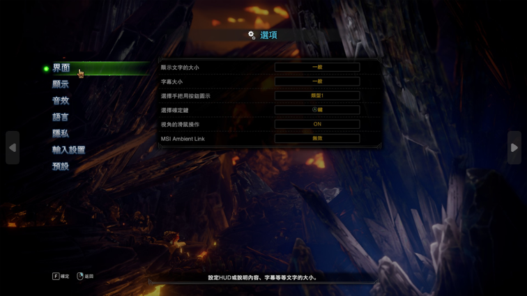
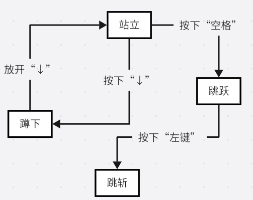
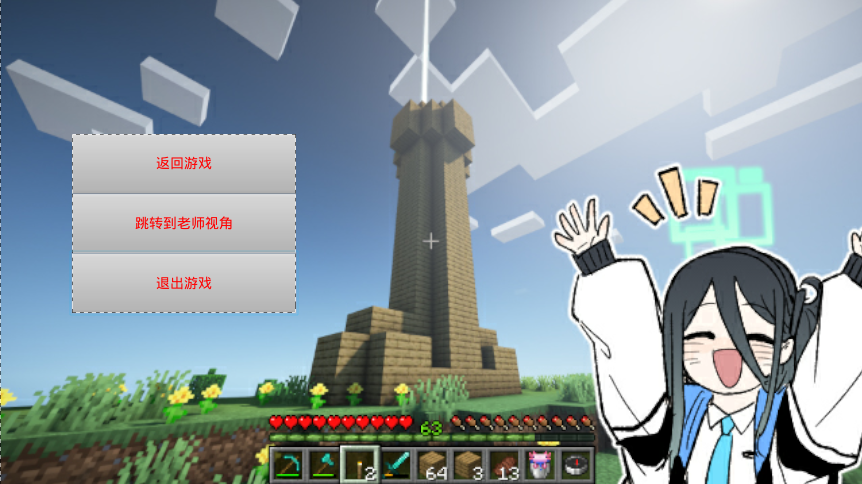
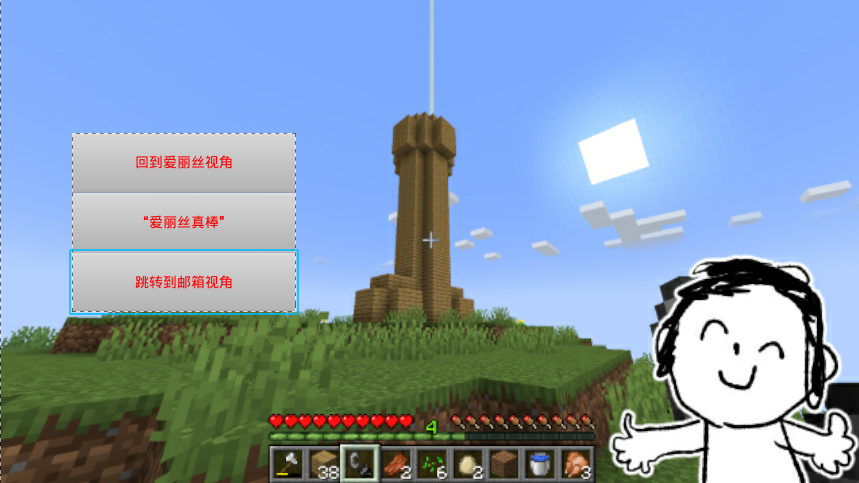
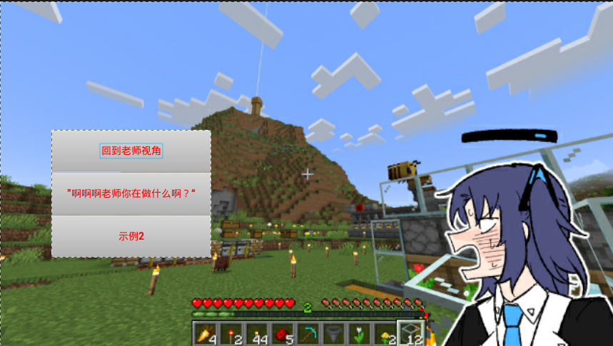
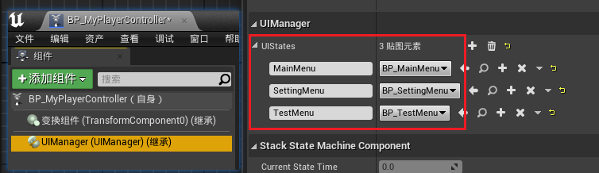
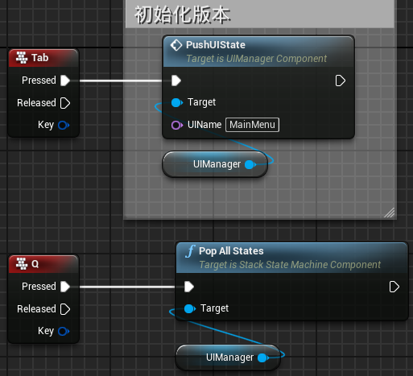
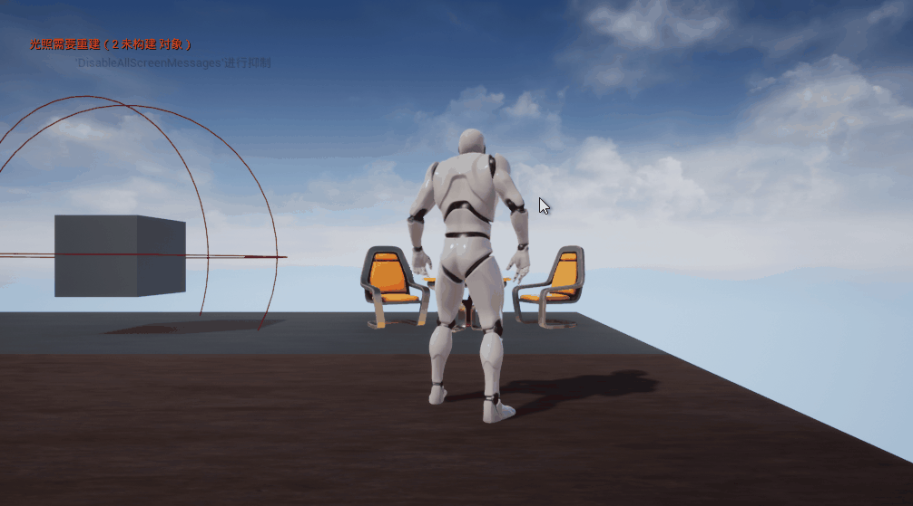

> UE 4.27 源码版本，VS 2022 17.9.6

---
# 前置知识

- [状态机是怎么个回事](../../阅读书籍/游戏设计模式/【游戏设计模式】状态机.md)
- [游戏里的状态模式是怎么个回事](../../阅读书籍/游戏设计模式/【游戏设计模式】状态模式.md)

---
# 状态机与 UI

## UI 的基本行为
先来思考一下 UI 的基本行为，以下图举例：


当我们打开游戏之后首先进入的就是主菜单界面，在界面左侧有着一列按钮，这些按钮有着不同的功能：

- 按下“开始游戏”跳转到“存档界面”
- “存档界面”能退回到“主界面”
- 按下“选项”，主界面按钮隐藏并显示“选项设置界面”
- “选项设置界面”同样能退回到“主界面”
- ...
- “退出游戏”：关闭游戏并退回桌面

如果我们点击“选项”，则会出现下图所示界面：



主界面的按钮被隐藏，取而代之的是选项界面的相关控件。如果进一步点击选项界面的控件，又会弹出其他界面，选项界面又被新的子界面所覆盖。

如果想要关闭子界面返回上一界面，试想此时正处在选项界面的子界面之中，我们必须要先把子界面关闭，再把选项界面关闭，才能回到主界面。

发生了先进后出的行为，所以可以利用栈来管理，进入一个界面相当于界面入栈，如果需要返回，就是界面出栈。

## 栈状态机和 UI 管理

在之前的[状态机模式](../../阅读书籍/游戏设计模式/【游戏设计模式】状态模式.md)中学习到了一种分层状态机的实现，其中一个实现方式就是利用栈。

接下来再稍微仔细考虑一下，状态的属性和 UI 操作的相似性：

- **状态**：每个界面都是状态机中的一个状态。当前的激活界面（状态）为栈顶界面（状态），玩家的操作都会被这个界面（状态）捕获。
- **行为**：界面（状态）上存在许多控件（方法），这些控件描述了这个界面（状态）的行为
  - **状态间转移**：像上图中的按钮基本都需要从当前界面转移到另一个新界面，**转移条件**就是对应的按钮被按下
  - **状态内更新**：一般界面上的按钮或多或少都会导致新界面的创建，但有些界面上存在需要实时更新的元素，比如上边主界面背景就是动态的需要一直更新
  - **进入操作**：状态需要有进入操作，UI 也是同理，有些时候打开一个界面并不是直接就能操作的，一般都会有一个很短的出现动画效果，这就需要在这里实现或调用相关方法（个人理解），也或许是其他的准备工作
  - **退出操作**：类似的退出动画等等

可以看到对 UI 的操作可以很方便的联系到状态机的相关概念。有了状态，还需要有一个负责管理状态的状态机。在这里我们将实现一个基于栈状态机的，负责管理 UI 的管理器。


---
# 基于栈状态机的通用管理框架

对于栈来说，有两种行为：入栈和出栈，利用枚举值定义这两种行为：

```cpp
enum StackAction{
    PUSH,
    POP
};
```

同时对于一个状态，它应当有如下三个最基本的行为：

```cpp
void EnterState();
void ExitState();
void UpdateState();
```

为了方便生成日志文件，这里可以声明栈状态特有的标志：

```cpp
DECLARE_LOG_CATEGORY_EXTERN(LogStateMachine, Log, All);
DECLARE_LOG_CATEGORY_EXTERN(LogStackStateMachine, Log, All);
```

**记得在使用的地方添加：`DEFINE_LOG_CATEGORY(LogStackStateMachine);`**

## 定义通用状态和接口方法

因为状态机是要用在 UE 中的，这里还需要针对应的修改一下。对于栈的状态要用`UENUM()`修饰，由于这三个行为是所有状态的共有行为，所以可以利用接口实现。这样，任何一个可以作为状态实现的类，都可以通过这个接口被状态机管理。

> 在 UE 中创建 C++ 类已经在先前的文章中描述过这里不再赘述

```cpp
UENUM(BlueprintType)
enum StackAction{
    PUSH,
    POP
};

UINTERFACE(meta = (CannotImplementInterfaceInBlueprint))
class UStackStateInterface : public UInterface
{
	GENERATED_BODY()
};
class UE_DEMO_MHW_API IStackStateInterface
{
	GENERATED_BODY()
public:
	/* 声明状态机动作 */
	virtual void EnterState(EStackAction StackAction) = 0; // 进入状态动作
	virtual void ExitState(EStackAction StackAction) = 0; // 退出状态动作
	virtual void UpdateState(float DeltaTime) = 0; // 状态内动作
};
```

## 定义通用栈状态类

任何一个类通过上边的接口都可以实现三个状态动作，除此之外为了保证通用性，这里可以从`UObject`新派生一个自定义类`StackState`，作为通用栈状态类模板，用来给一些自定义的类提供基类模板。如果是想要给`UUserWidget`实现相关状态类，直接从`UUserWidget`派生，连接上上边的接口即可。

这里的`StackState`只是为了作为一个更通用的栈状态父类而实现的

`StackState.h`

```cpp
UCLASS(Abstract, BlueprintType, Blueprintable, HideCategories=("Cokking", "LOD", "Physics", "Activation", "Tags", "Rendering"))
class UE_DEMO_MHW_API UStackState : public UObject, public IStackStateInterface
{
    GENERATED_BODY()
public:
    virtual void EnterState(EStackAction StackAction) override;
    virtual void ExitState(EStackAction StackAction) override;
    virtual void UpdateState(float DeltaTime) override;

    // 设置蓝图实现版本，方便子蓝图类重载
    UFUNCTION(BlueprintImplementableEvent, Category="StackState", meta=(DisplayName="OnEnterState"))
    void ReceiveEnterState(EStackAction StackAction);
	UFUNCTION(BlueprintImplementableEvent, Category="StackState", meta=(DisplayName="OnExitState"))
	void ReceiveExitState(EStackAction StackAction);
	UFUNCTION(BlueprintImplementableEvent, Category="StackState", meta=(DisplayName="OnUpdateState"))
	void ReceiveUpdateState(float DeltaTime);
}
```

`StackState.cpp`

```cpp
#include "StackState.h"

void UStackState::EnterState(EStackAction StackAction)
{
	/* 调用蓝图版本 */
	ReceiveEnterState(StackAction);
}

void UStackState::ExitState(EStackAction StackAction)
{
	/* 调用蓝图版本 */
	ReceiveExitState(StackAction);
}

void UStackState::UpdateState(float DeltaTime)
{
	/* 调用蓝图版本 */
	ReceiveUpdateState(DeltaTime);
}
```

由于在这里将`StackState`的`UCLASS`属性设置为了`Abstract`抽象基类，这阻止了该类进入`Level`中的实例化（但子类似乎可以？），可以用来实现一个抽象概念的状态管理


## 定义通用栈状态机

定义好了状态之后，还需要有状态机进行更新管理，为了复用这里从`ActorComponent`派生

```cpp
UCLASS( Blueprintable, BlueprintType, meta=(BlueprintSpawnableComponent))
class UE_DEMO_MHW_API UStackStateMachineComponent : public UActorComponent, public IStackStateInterface
{
	GENERATED_BODY()
    ...
}
```

状态机示意图如下：



根据图示可以总结一下几点：
- 状态机维护一个序列，该序列存储了其负责管理的所有状态
- 状态负责检测状态转移条件以及管理状态之间的转移

所以我们需要创建一个状态序列，并基于栈的行为实现状态管理

### 储存状态序列

给状态机添加一个`TArray`用来存储负责管理的状态：

```cpp
protected:
    TArray<TScriptInterface<IStackStateInterface>> States;
    UPROPERTY(VisibleAnywhere)
    float CurrentStateTime = 0;
```

在这里利用`TArray`模板，创建了一个序列，该序列可以存放**任何一个实现了给定接口的`UObject`的引用**

- [`TScriptInterface`的官方文档说明](https://docs.unrealengine.com/4.27/en-US/API/Runtime/CoreUObject/UObject/TScriptInterface/)

同时增加了一个`flaot`来存储当前状态的持续时间，方便拓展

### 对状态序列操作（管理栈状态）

接下来需要实现对`TArray`中状态的管理，对于一个栈有着入栈和出栈两个操作：

```cpp
public:
    /* Push a state to stack. */
    UFUNCTION(BlueprintCallable, Category="StackStateMachine")
    void PushState(TScriptInterface<IStackStateInterface> NewState);

    /* Pop a state from stack (throw an error if no that state) */
    UFUNCTION(BlueprintCallable, Category="StackStateMachine")
    void PopState();

    /* Pop state count times */
    UFUNCTION(BlueprintCallable, Category="StackStateMachine")
    void PopStates(int Count);

    /* Pop all states */
    UFUNCTION(BlueprintCallable, Category="StackStateMachine")
    void PopAllStates();
```

为了方便，这里声明几个工具函数：

```cpp
/* 一些工具方法 */
public:
    /* 获取当前状态 */
	UFUNCTION(BlueprintPure, Category="StackStateMachine")
	TScriptInterface<IStackStateInterface> GetCurrentState() { return States[StateCount() - 1]; }

    /* 获取次级状态 */
	UFUNCTION(BlueprintPure, Category="StackStateMachine")
	TScriptInterface<IStackStateInterface> GetUnderState() {return States[StateCount() - 2]; }

    /* 获取指定下标的状态 */
	UFUNCTION(BlueprintPure, Category="StackStateMachine")
	TScriptInterface<IStackStateInterface> GetState(int32 Index) { return States[Index]; }

    /* 获取状态数量 */
	UFUNCTION(BlueprintPure, Category="StackStateMachine")
	int32 StateCount() const { return States.Num(); }

    /* 获取当前状态持续时间 */
	UFUNCTION(BlueprintPure, Category="StackStateMachine")
	FORCEINLINE float GetCurrentStateTime() const { return CurrentStateTime; }
```


对于`PushState()`，首先要确认当前状态机是否正处于某个状态，如果是需要先将该状态退出`ExitState()`，并出栈`PopState()`，再将新状态入栈`PushState(NewState)`，并进入状态`EnterState()`

```cpp
void UStackStateMachineComponent::PushState(TScriptInterface<IStackStateInterface> NewState)
{
    if(NewState != nullptr)
    {
        /* 退出旧状态 */
        if(StateCount() > 0) // 确认有状态
        {
            auto CurrentState = GetCurrentState();
            if(CurrentState != nullptr)
            {
                CurrentState->ExitState(PUSH);
            }
        }
        /* 持续时间清零 */
        CurrentStateTime = 0;
        /* 新状态入栈 */
        States.Push(NewState);
        NewState->EnterState(PUSH);

/* 通知外部，自己发生了“新状态进入”事件 */
        StatePushed(NewState); // 见：栈状态的广播
    }
}
```

注意上放`CurrentState->ExitState(PUSH);`和`NewState->EnterState(PUSH);`，这里的`PUSH`表示的是其执行退出/进入行为的原因
- 对于旧状态，因为新状态的入栈，导致自己需要退出，所以是`PUSH`
- 对于新状态，同样是因为自己的入栈，使得自己要进入，所以也是`PUSH`

对于`PopState()`实现起来也是同理：

```cpp
void UStackStateMachineComponent::PopState()
{
    // 获得当前状态
    auto OriginState = GetCurrentState();
    if(OriginState != nullptr)
    {// 有则弹出
        OriginState->ExitState(POP);
    }
    CurrentStateTime = 0; // 时间清零
    States.Pop(); // 弹出状态
    if(StateCount > 0)
    {// 如果还有状态，就进入新状态
        GetCurrentState()->EnterState(POP);
    }

/* 向外部广播自己发生了“有状态被 Pop”的事件*/
    StatePopped(OriginState); // 见：栈状态的广播
}
```

在`PopState()`中，同样有`OriginState->ExitState(POP);`和`GetCurrentState()->EnterState(POP);`，分别表示：
- 旧状态退出，是因为自己被弹出
- 新状态进入，是因为有状态被弹出

通过这种方式，可以细分`EnterState()`和`ExitState()`事件的描述粒度


### 栈状态机也是状态

如果仔细观察会发现，在之前声明状态机组件的时候同样接上了`IStackStateInterface`接口，目的就是为了实现层级嵌套效果，也方便拓展。

> 个人理解：  
> 回想之前的 UI 界面  
> 当处于主菜单时，可以使用一个状态机维护这些 UI。  
> 而当我们进入到游戏中时，这部分 UI 实际上已经没有必要再去维护了，并且除非玩家自己选择退回主界面，否则主界面相关的部分已经不再会使用到。  
> 并且进入游戏场景也需要更换另一套 UI 界面进行维护。  
> 或者说，游戏的场景进行了切换，本身也是被一个更大的状态机去管理的，例如`enum GameScene{ MAIN_MENU, IN_GAME, IN_BATTLE }`。  
> 不同的游戏场景由不同的状态机负责管理，这样既可以实现功能解耦也能利于后期的维护。

所以这里也要对状态机实现“状态具有的行为”

```cpp
public:
/* 接口方法 */
	virtual void EnterState(EStackAction StackAction) override;
	virtual void ExitState(EStackAction StackAction) override;
	/* Update current state, call ite in Tick() */
	virtual void UpdateState(float DeltaTime) override;

/* 状态机自己的进入动作、退出动作和更新动作 */
	UFUNCTION(BlueprintImplementableEvent, Category="StackStateMachine", meta=(DisplayName = "OnEnterState"))
	void ReceiveEnterState(EStackAction StackAction);

	UFUNCTION(BlueprintImplementableEvent, Category="StackStatemachine", meta=(DisplayName = "OnExitState"))
	void ReceiveExitState(EStackAction StackAction);

	UFUNCTION(BlueprintImplementableEvent, Category="StackStateMachine", meta=(DisplayName = "OnUpdateState"))
	void ReceiveUpdateState(float DeltaTime);
```

定义实现放在[下一节中](#广播状态机的进入和退出事件)

### 栈状态机的广播

在具体的实现中，可能存在其他的东西要对栈状态机的某些操作进行响应，这时候需要用到委托

为了保证通用性，这里将多播委托的声明放在了**接口头文件中`StackStateInterface.h`**

```cpp
/* StackStateInterface.h */
DECLARE_DYNAMIC_MULTICAST_DELEGATE(FOnStateEnterSignature);
DECLARE_DYNAMIC_MULTICAST_DELEGATE(FOnStateExitSignature);
DECLARE_DYNAMIC_MULTICAST_DELEGATE(FOnStateUpdateSignature);
```

这样，引入头文件后就可以很方便的在相关引用的文件中添加事件调度器，方便广播事件，使其他类对该状态机做出反应

#### 广播状态的入栈和出栈事件

比如，有新状态进入和旧状态弹出时。

> 应用猜想：  
> 比如只狼中，喝药引屑一郎突刺，在不考虑复杂的行为树和 AI 的情况下  
> 就可以利用这种方式，一旦玩家进入“喝药状态”，屑一郎就会使用突刺攻击玩家

```cpp
/* 作为状态机管理状态 */
public:
	// 有新状态进入时执行
	UPROPERTY(BlueprintAssignable, Category="StackStateMachine")
	FOnStackStatePushPopSignature OnStatePushed;
	// 有就状态弹出时执行
	UPROPERTY(BlueprintAssignable, Category="StackStateMachine")
	FOnStackStatePushPopSignature OnStatePopped;
```

于是定义两个方法，检查是否有绑定到委托上的事件，有则广播：

```cpp
// 
protected:
    virtual void StatePushed(TScriptInterface<IStackStateInterface> PushedState);
    virtual void StatePopped(TScriptInterface<IStackStateInterface> PoppedState);

// 提供蓝图接口
public:
	UFUNCTION(BlueprintImplementableEvent, Category="StackStateMachine", meta=(DisplayName = "StatePushed"))
	void ReceiveStatePushed(const TScriptInterface<IStackStateInterface>& PushedState);

	UFUNCTION(BlueprintImplementableEvent, Category="StackStateMachine", meta=(DisplayName = "StatePopped"))
	void ReceiveStatePopped(const TScriptInterface<IStackStateInterface>& PopppedState);
```

定义实现：

```cpp
void UStackStateMachineComponent::StatePushed(TScriptInterface<IStackStateInterface> PushedState)
{
    UE_LOG(LogStackStateMachine, Display, TEXT("PushedState: %s"), *PushedState->_getUObject()->GetName());
    if(OnStatePushed.IsBound())
    {
        OnStatePushed.Broadcast(PushedState);
    }
    // 别忘了调用蓝图接口
    ReceiveStatePushed(PushedState);
}

void UStackStateMachineComponent::StatePushed(TScriptInterface<IStackStateInterface> PoppedState)
{
    UE_LOG(LogStackStateMachine, Display, TEXT("PoppedState: %s"), *PoppedState->_getUObject()->GetName());
    if(OnStatePopped.IsBound())
    {
        OnStatePopped.Broadcast(PoppedState);
    }
    ReceiveStatePopped(PoppedState);
}
```

具体调用已经在[对状态序列操作（管理栈状态）](#对状态序列操作（管理栈状态）)中实现。


#### 广播状态机的进入和退出事件

和状态的出入栈广播类似，**状态机**自身被管理时的进出状态也要进行广播

```cpp
/* 作为子状态机 */
public:

	// 进入状态时执行
	UPROPERTY(BlueprintAssignable, Category="StackStateMachine")
	FOnStateEnterSignature OnStateEnter;

	// 退出状态时执行
	UPROPERTY(BlueprintAssignable, Category="StackStateMachine")
	FOnStateExitSignature OnStateExit;
```

实现状态机作为状态的三个行为：

```cpp
void UStackStateMachineComponent::EnterState(EStackAction StackAction)
{
    if(OnStateEnter.IsBound())
    {// 进入该状态机时广播
        OnStateEnter.Broadcast();
    }
    // 调用蓝图实现
    ReceiveEnterState(StackAction);
}

void UStackStateMachineComponent::ExitState(EStackAction StackAction)
{// 退出该状态机时广播
    if(OnStateExit.IsBound())
    {
        OnStateExit.Broadcast();
    }
    // 调用蓝图实现
    ReceiveExitState(StackAction);
}

void UStackStateMachineComponent::UpdateState(float DeltaTime)
{
	CurrentStateTime += DeltaTime;
	if (StateCount() > 0 && GetCurrentState() != nullptr)
	{
		GetCurrentState()->UpdateState(DeltaTime);
	}
    // 调用蓝图实现
    ReceiveUpdateState(DeltaTime);
}
```

## 通用框架的小结

这部分实现了基于栈的状态机及基于栈状态机的一套管理框架。

- **状态**：对于抽象基类，可以直接从定义的`UStackState`进行派生；对于需要放置在场景中的，则从现有基类派生，并添加`IStackStateInterface`接口。

- **状态机/状态管理**：因为实现了通用的状态机组件`UStackStateMachineComponent`，所以直接在`AActor`中添加即可。

这个状态机组件的添加位置理论上是随意的，但为了符合 MCV 模式，推荐放在`Controller`中（个人理解）

---
# 实现基于栈状态机的 UI 管理框架

在有了通用的管理框架后，衍生出其他管理框架就变得简单了许多，UI 状态机管理组件直接在`PlayerController`中引入即可

因为我们最终想要实现的，是对游戏的 UI 管理，所以具体的 UI 状态类`UIState`，应当继承自`UUserWidget`而不是`UStackState`。

## 实现自定义状态类：`UIState`

创建一个 C++ 类，继承自`UUserWidget`，并添加`IStackStateInterface`接口

```cpp
UCLASS()
class UE_DEMO_MHW_API UUIState : public UUserWidget, public IStackStateInterface
{
	GENERATED_BODY()
}
```

记得重写接口定义的三个方法，并添加相应的蓝图接口函数，方便子类重写：

```cpp
public:
    virtual void EnterState(EStackAction StackAction) override;
    virtual void ExitState(EStackAction StackAction) override;
    virtual void UpdateState(float DeltaTime) override;

	UFUNCTION(BlueprintNativeEvent, Category="StackState", meta = (DisplayName="OnEnterState"))
	void ReceiveEnterState(EStackAction StackAction);

	UFUNCTION(BlueprintNativeEvent, Category="StackState", meta = (DisplayName="OnExitState"))
	void ReceiveExitState(EStackAction StackAction);

	UFUNCTION(BlueprintNativeEvent, Category="StackState", meta = (DisplayName="OnUpdateState"))
	void ReceiveUpdateState(float DeltaTime);
```

老三样的实现还是一样，调用蓝图实现：

```cpp
void UUIState::EnterState(EStackAction StackAction)
{
	ReceiveEnterState(StackAction);
}

void UUIState::ExitState(EStackAction StackAction)
{
	ReceiveExitState(StackAction);
}

void UUIState::UpdateState(float DeltaTime)
{
	ReceiveUpdateState(DeltaTime);
}
```


不过和`StackState`中不同的是，为了方便，此时将蓝图回调声明为了`BlueprintNativeEvent`版本，所以可以先实现一个 C++ 版本的，后续如果在蓝图内需要重新实现可以直接覆盖掉 C++ 版本的


对于 UI，当发生进入事件时，必然是要将 UI 显示在屏幕上，**但要注意，发生进入事件的情况是怎样的**。在之前[定义通用状态](#定义通用状态和接口方法)这里定义了栈的两种行为，并且在实现通用状态机那里也提到了因为 `PUSH` 而 `ENTER/EXIT` 和 `POP` 而 `ENTER/EXIT` 的情况，这里也是需要考虑的情形之一：
- 当 UI 因为
  - PUSH 而 Enter 时，新添加的状态是自己，所以需要显示在屏幕上
  - POP 而 Enter 时，因为是旧状态被弹出，暴露出了自己，所以此时本身其实是已经添加在屏幕只是不可见而已，所以需要将可见性设置为可见
- Exit 的时候也是同理
  - 因为 PUSH，说明新状态添加到了自己上层，那必然是要可见度设为隐藏
  - 因为 POP，那说明自己被弹出不再需要显示了，就移除自己

```cpp
void UUIState::ReceiveEnterState_Implementation(EStackAction StackAction)
{
    switch StackAction{
        case PUSH:{// 因入栈而 Enter
            AddToViewport();
            break;
        }
        case POP:{// 因出栈而 Enter
            SetVisibility(ESlateVisibility::Visible);
            break;
        }
    }
}

void UUIState::ReceiveExitState_Implementation(EStackAction StackAction)
{
    switch StackAction:
    {
        case PUSH:{// 因 PUSH 而 Exit
            SetVisibility(ESlateVisibility::Hidden);
            break;
        }
        case POP:{// 因 POP 而 Exit
            RemoveFromParent();
            break;
        }
    }
}


void UUIState::ReceiveUpdateState_Implementation(float DeltaTime)
{
	// 要不要实现 C++ 版本随意
}
```


## 实现自定义栈状态机：`UUIManagerComponent`

创建继承自`UStackStateMachineComponent`的 UI 管理组件

```cpp
UCLASS()
class UE_DEMO_MHW_API UUIManagerComponent : public UStackStateMachineComponent
{
	GENERATED_BODY()
    // ...
}
```

### UI 管理器要管理的 UI

回想实现[通用栈状态机管理器](储存状态序列)的时候，额外创建了一个序列用来存储状态机负责管理的全部状态。

```cpp
/* UStackStateMachineComponent.h */
protected:
    TArray<TScriptInterface<IStackStateInterface>> States;
```

理论上，由于`States`内部元素，只要实现了指定的接口就可以存入，但目前所做的工作都是为了方便后续在引擎中或着说，在蓝图中能够更方便简洁的使用的，所以这里在 UI 管理器组件中，新增两个容器：

```cpp
public:
    UPROPERTY(EditDefaultOnly, Category="UIManager")
    TMap<FName, TSubclassOf<UUIState>> UIStates;
private:
    UPROPERTY()
    TMap<FName, UUIState*> UIInstances;
```

> [`TSubclassOf<UUIState>>`官方文档](https://docs.unrealengine.com/4.27/zh-CN/ProgrammingAndScripting/ProgrammingWithCPP/UnrealArchitecture/TSubclassOf/)

下面来解释一下这两个变量的目的：

> **在软件或游戏运行过程中，应当避免不必要的创建和销毁**
>
> 对象池相关的部分暂时还没学到，等后续学到了会把这部分一并更新，这里聊当下的实现方案

一个游戏中场景不同，相关的 UI 也不同，但不管怎么说游戏的 UI 有哪些，基本都是已经确定的。

所以，为了满足上边那条要求，我们就可以提前把需要的 UI 全部创建出来，等需要的时候再`AddToViewport()`，不需要了就`RemoveFromParent`，至少在同一个场景内这么做吧（比如 MHW 中，任务中有一套 UI，在据点又有一套，虽然有相同的部分）。

那么，对于一个 UI 管理器，它负责管理的 UI 种类，便被存放在`UIStates`中，并且设置了`EditDefaultOnly`，可以在蓝图中添加需要管理的 UI

下一步便是创建/初始化/实例化 UI，有了要创建的种类就可以利用模板函数`CreateWidget<T>()`创建指定类型的 UI，并在`UIInstances`存放对应的实例指针，方便调用

所以这里实现两个函数：

```cpp
/* .h */
DECLARE_LOG_CATEGORY_EXTERN(LogUIManager, Log, All);

public:
void BeginPlay() override;

UFUNCTION(BlueprintNativeEvent, Category="UIManager")
void InitUIStates();

/* .cpp */
DEFINE_LOG_CATEGORY(LogUIManager);

/* 运行时初始化 */
void UUIManagerComponent::BeginPlay()
{
	Super::BeginPlay();

	InitUIStates();
}

/* 创建全部 UI 实例*/
void UUIManagerComponent::InitUIStates_Implementation()
{
	// 获取
	auto PC = UGameplayStatics::GetPlayerController(GetOwner(), 0);
	if (!PC->IsLocalPlayerController())
	{
		UE_LOG(LogUIManager, Display, TEXT("%s Is not local playercontroller, skipping init uistates."), *PC->GetName());
		return;
	}
	for(TTuple<FName, TSubclassOf<UUIState>> UI : UIStates)
	{
		auto Widget = CreateWidget<UUIState>(PC, UI.Value.Get(), UI.Key);
		UE_LOG(LogUIManager, Display, TEXT("初始化 UI：%s"), *UI.Key.ToString());
		UIInstances.Add(UI.Key, Widget);
	}
	UE_LOG(LogUIManager, Display, TEXT("Initialized UIManager."));
}
```


### UI 管理器要实现的方法

实际上，状态机的核心管理逻辑已经在基类中实现，具体派生出来的状态机只需要添加一些特定状态类的方法即可，在这里简单实现几个函数：

```cpp
// 通过名字从 UIStates 中获取对应 UI 实例
UFUNCTION(BlueprintPure, BlueprintNativeEvent, Category="UIManager", meta=(DisplayName="GetUI"))
UUIState* GetUI(FName UIName);

// UIState 对象入栈
UFUNCTION(BlueprintCallable, BlueprintNativeEvent, Category="UIManager", meta=(DisplayName="PushUIState"))
void PushUIState(FName UIName);
```

具体实现如下：

```cpp
UUIState* UUIManagerComponent::GetUI_Implementation(FName UIName)
{
	UUIState** UI = UIInstances.Find(UIName);
	if (UI != nullptr)
	{
		return *UI;
	}
	UE_LOG(LogUIManager, Error, TEXT("UIManager 中不存在：%s"), *UIName.ToString());
	return nullptr;
}

void UUIManagerComponent::PushUIState_Implementation(FName UIName)
{
	auto UI = GetUI(UIName);
	if (UI == nullptr) return;

	PushState(UI);
}
```

如有需要可以继续添加其他方法。


## 实战测试

1. 基于`UIState`派生三个蓝图子类，

| 界面一                                      | 界面二                                          | 界面三                                       |
| ---------------------------------------- | -------------------------------------------- | ----------------------------------------- |
|  |  |  |


2. 创建`PlayerController`（C++ 实现，这里略），添加`UUIManagerComponent`组件，并设置要实例化的 UI 蓝图类




3. `Tab`键开启`MainMenu`，其余跳转逻辑直接在对应 UI 蓝图中实现，（正向）跳转顺序为“界面一 -> 界面二 -> 界面三”




4. 最终效果




---
# 参考链接
- [用状态机处理复杂的 UI 状态](https://blog.icyh.me/component-design/state-machine/)
- [UE4 基于栈状态机的 UI 管理 (框架设计)](https://zhuanlan.zhihu.com/p/143882791)

