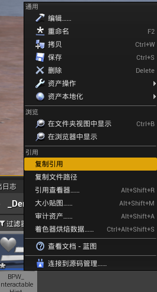
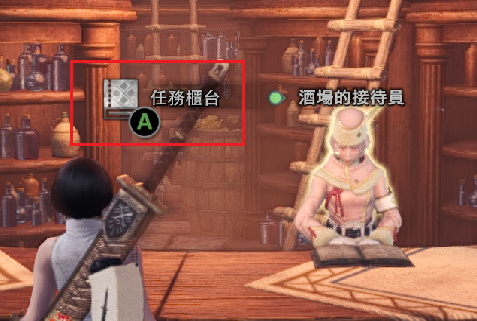
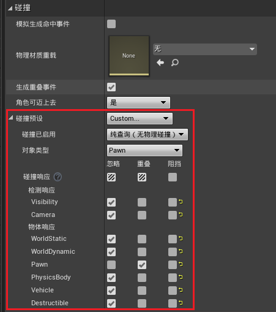
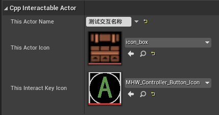
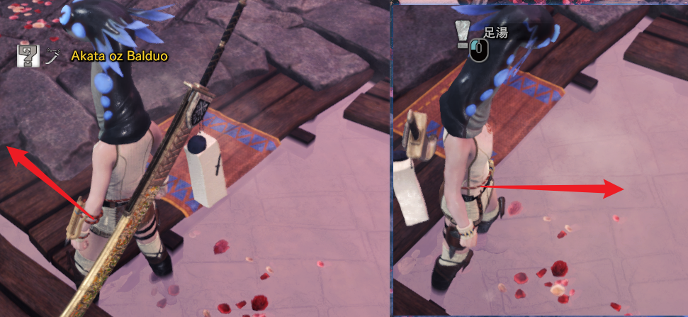

> UE 4.27 源码版本，VS 2022 17.9.6

结合[基于 C++ 的第三人称角色](../【初识】利用Cpp制作第三人称角色/README.md)和[基于 C++ 的简单 UI](../【初识】利用Cpp制作简单的UI/README.md)，以及简单的一些扩展就可以实现了

先来看下最终效果：


---
# 前言

对于 Widget 的制作可以参考[基于 C++ 的简单 UI](../【初识】利用Cpp制作简单的UI/README.md)，这里不再赘述实现，假定已经实现了类似图中的 Widget。

后续需要新建的 C++ 类，一个继承 Actor，一个继承 WidgetComponent（其实直接在角色里添加这个 Component 并设置也可以，不过我希望的是能在蓝图里添加这个 Component 并且默认已经设置好了）

---
# WidgetComponent 的设置

创建 C++ 类后代码如下：

```cpp
#pragma once

#include "CoreMinimal.h"
#include "Components/WidgetComponent.h"
#include "Cpp_InteractableComponent.generated.h"

UCLASS(Blueprintable, ClassGroup = "UserInterface", meta = (BlueprintSpawnableComponent))
class UE_DEMO_MHW_API UCpp_InteractableComponent : public UWidgetComponent
{
	GENERATED_BODY()
	
public:
	UCpp_InteractableComponent();
};
```

这里要修改的东西不多，只需要把其中的 `WidgetClass` 设置成先前创建好的蓝图类即可

```cpp
UCpp_InteractableComponent::UCpp_InteractableComponent()
{
	WidgetClass = LoadClass<UUserWidget>(this, TEXT("WidgetBlueprint'/Game/_Demo_MHW/Widgets/BPW_InteractableHint.BPW_InteractableHint_C'"));
	
    // 设置屏幕空间
	SetWidgetSpace(EWidgetSpace::Screen);
    // 设置开始时看不到
	SetVisibility(false);
}
```

这里需要提的是设置`WidgetClass`，可以参考[这里](../../学习笔记/UE源码相关/动态加载：LoadClass和LoadObject.md)

通过`LoadClass`来加载蓝图并获取蓝图的 Class，要注意这里的模板参数，要写成**蓝图中所设置的父类**（可以参考[这里的第三步中的内容](../【初识】利用Cpp制作简单的UI/README.md)）

后边的一长串`"WidgetBlueprint'/Game/_Demo_MHW/Widgets/BPW_InteractableHint.BPW_InteractableHint_C'"`是创建的控件蓝图的引用地址

右键复制引用即可



**要注意**：复制之后的内容中不存在最后的 `_C`，要手动添加，否则无法识别

其实还可以在 Component 中添加一些方法用来设置内部的 Widget，但我比较懒，这里就这样吧 :)

---
# InteractableActor 的设置

## 可交互属性

按照之前的设想，我打算实现的其实是怪物猎人世界中靠近可交互物体就显示交互提示的效果



可以看到，交互提示上显示的内容为：可交互对象的图标、可交互对象的名称、以及可交互按键图标

所以这里同样设置这三个属性

```cpp
public:
	/* 可交互属性 */
	UPROPERTY(EditAnywhere, BlueprintReadWrite)
	FText This_ActorName;
	UPROPERTY(EditAnywhere, BlueprintReadWrite)
	UTexture2D* This_ActorIcon;
	UPROPERTY(EditAnywhere, BlueprintReadWrite)
	UTexture2D* This_InteractKeyIcon;
```

这里将三个属性设置为 `EditAnywhere` 保证蓝图内可设置，方便使用


## 可交互判断

当玩家角色进入到可交互范围时，可交互对象将自己的中三个属性信息发送给玩家的 WidgetComponent，并显示在屏幕上

所以这里还需要给 Actor 添加一个碰撞组件，这里还添加了一个网格体组件用来显示位置

```cpp
UPROPERTY()
class USceneComponent* DefaultSceneRoot;
UPROPERTY(EditDefaultsOnly)
class UStaticMeshComponent* VisibleStaticMeshComponent;
UPROPERTY(EditDefaultsOnly)
class USphereComponent* InteractableCollisionComponent;
```

创建并设置依附组件可以参考[第三人称实现中的组件部分](../../../Ignore/Base/UE_Base_利用Cpp制作第三人称角色.md)

这里给一下对碰撞组件的设置：

```cpp
/* 自定义碰撞检测 */
InteractableCollisionComponent->SetCollisionProfileName(TEXT("Custom"));
InteractableCollisionComponent->SetCollisionEnabled(ECollisionEnabled::QueryOnly);
InteractableCollisionComponent->SetCollisionObjectType(ECC_Pawn);
InteractableCollisionComponent->SetCollisionResponseToAllChannels(ECR_Ignore);
InteractableCollisionComponent->SetCollisionResponseToChannel(ECC_Pawn, ECR_Overlap);
```

这部分设置其实也挺简单，就是把蓝图中的下图内容变成了代码的形式，代码和下图结合看很容易就能看懂




## 可交互的必要条件

想要和物体交互则必须进入到对应范围内，这里就需要用到球体碰撞的碰撞检测事件，声明两个方法：

```cpp
public:
/* 开始重叠事件 */
	UFUNCTION()
	virtual void OnOverlapBegin(UPrimitiveComponent* OverlappedComponent, AActor* OtherActor, UPrimitiveComponent* OtherComponent, int32 OtherBodyIndex, bool bFromSweep, const FHitResult& SweepResult);
/* 结束重叠事件 */
	UFUNCTION()
	virtual void OnOverlapEnd(UPrimitiveComponent* OverlappedComponent, AActor* OtherActor, UPrimitiveComponent* OtherComponent, int32 OtherBodyIndex);
```

函数签名很长，但实际上就是蓝图中这个节点的那些输出内容，**要注意的也就是 OnOverlapEnd 的签名比 OnOverlapBegin 的签名少，不要全部复制**


## 绑定事件

绑定事件一般推荐在`BeginPlay()`中进行：

```cpp
// Called when the game starts or when spawned
void ACpp_InteractableActor::BeginPlay()
{
	Super::BeginPlay();
	
	/* 绑定事件 */
	InteractableCollisionComponent->OnComponentBeginOverlap.AddDynamic(this, &ACpp_InteractableActor::OnOverlapBegin);

	InteractableCollisionComponent->OnComponentEndOverlap.AddDynamic(this, &ACpp_InteractableActor::OnOverlapEnd);
}
```

## 碰撞事件设置

最后还需要设置一下碰撞时会发生什么

回想之前想要实现的效果：

玩家走进可交互范围，收到可交互对象的信息，通过 WidgetComponent 设置给内部的 Widget，最后显示在屏幕上

所以这里首先要判断一下，触发事件的是否是玩家

> 下方默认在 `OnOverlapBegin()` 函数体中设置

首先尝试将检测到的 Actor 转为我们自定义的角色类，如果转换失败会得到 `nullptr`
```cpp
ACpp_PlayerCharacter* GetBeginOverlapedTarget = Cast<ACpp_PlayerCharacter>(OtherActor);
if (GetBeginOverlapedTarget)
{
    // 进一步操作
}
```

如果顺利得到，可以通过 `GEngine->AddOnScreenDebugMessage()` 在屏幕上显示一条信息以提示

接下来，还需要得到玩家的 `WidgetComponent` 与 组件中的 `widget`

要使用的方法为`GetComponentByClass()`

所以得到组件同理

```cpp
Cpp_InteractableComponent* WidgetComp = Cast<UCpp_InteractableComponent>(GetBeginOverlapedTarget->GetComponentByClass(UCpp_InteractableComponent::StaticClass()));
if (WidgetComp && WidgetComp->GetUserWidgetObject())
{// 确保 Comp 存在并且其内部的 Widget 对象也存在
    GEngine->AddOnScreenDebugMessage(-1, 5.0f, FColor::Red, TEXT("Find WidgetComp!"));
    // 剩下操作
}
```

最后去获得组件内的`Widget`，并将 `Actor` 的相关属性设置过去即可

```cpp
UCpp_InteractableHintWidget* Widget = Cast<UCpp_InteractableHintWidget>(WidgetComp->GetUserWidgetObject());
if (Widget)
{
    GEngine->AddOnScreenDebugMessage(-1, 5.0f, FColor::Red, TEXT("Find Widget!"));
    WidgetComp->SetVisibility(true); // 注意这里要将组件设置为可见
    Widget->SetActorName(This_ActorName);
    Widget->SetActorIcon(This_ActorIcon);
    Widget->SetKeyIcon(This_InteractKeyIcon);
}
```

对于 `OnOverlapEnd()` 实现也是同理，只不过不需要层层推进，得到 `WidgetComponent` 之后设置为不可见就行了


# 蓝图中的设置

利用创建好的这个 `InteractableActor` 派生一个蓝图类，打开可以在类默认值中看到交互信息：



这样，将 `Actor` 拖入场景后同样可以针对性设置不同的交互信息

要想有不同的外观，只需要另外设置 `MeshComponent` 就好了

---
# 补充 1

先前写的太丑了，尤其是`OnOverlapBegin`中的一大坨逻辑，实际上可以把不少东西都放到各自的内部实现。

比如，`InteractableActor`的目的是**检测玩家是否在可交互范围**和**检测玩家朝向**（见下文实现），所以它的功能，仅仅是负责：
- 当玩家在可交互范围时，告诉玩家自己的交互信息
- 当玩家朝向自己时，让玩家显示交互提示控件

此时`OnOverlapBegin`就可以重新整理成为：

```cpp
void ACpp_InteractableActor::OnOverlapBegin(UPrimitiveComponent* OverlappedComponent, AActor* OtherActor, UPrimitiveComponent* OtherComponent, int32 OtherBodyIndex, bool bFromSweep, const FHitResult& SweepResult)
{
	OverlapedTarget = Cast<ACpp_PlayerCharacter>(OtherActor);
	if (OverlapedTarget)
	{
		OverlapedTarget->RefreshWidgetComp(This_ActorName, This_ActorIcon, This_InteractKeyIcon);
	}
}
```

这样`InteractableActor`只负责告诉玩家自己的信息，至于更新 WidgetComponent？让玩家自己去做吧。

注意这里还额外存储了当前获取到的玩家信息，也方便后边计算玩家的朝向。**记得在`OnOverlapEnd`中将这个变量置为 nullptr**

同理，在传给玩家后，玩家要通知自己的 WidgetComponent 组件去更新控件中的信息

```cpp
void ACpp_PlayerCharacter::RefreshWidgetComp(FText& ActorName, UTexture2D* ActorIcon, UTexture2D* InteractKeyIcon)
{
	if (InteractableHintWidgetComp)
	{
		InteractableHintWidgetComp->RefreshWidget(ActorName, ActorIcon, InteractKeyIcon);
	}
}
```

继续，WidgetComponent 再通知 Widget 去更新：

```cpp
void UCpp_InteractableHintWidget::Refresh(FText& ActorName, UTexture2D* ActorIcon, UTexture2D* InteractKeyIcon)
{
	this->SetActorName(ActorName);
	this->SetActorIcon(ActorIcon);
	this->SetKeyIcon(InteractKeyIcon);
}
```

这样，每一步的代码都不多，而且能比之前清晰的看出来这些代码的目的。

---
# 补充 2

在补充 1 中重构了`OnOverlapBegin`函数，并提到了检测玩家朝向的问题，下面开始实现

在 MHW 中的交互提示实现中，还存在对玩家朝向的判定



实现起来不难，获取一下角色的朝向，计算一下角色位置和交互物体位置向量差，点乘一下判断正负即可。

继续在`InteractableActor`中设置，增加方法：`bool ACpp_InteractableActor::IsOtherActorFaceToThisActor()`

具体实现如下：

```cpp
bool ACpp_InteractableActor::IsOtherActorFaceToThisActor()
{
	if (OverlapedTarget)
	{
		FVector OtherActorToThisActor = GetActorLocation() - OverlapedTarget->GetActorLocation();
		OtherActorToThisActor.Normalize();
		float bIsFaceToThis = FVector::DotProduct(OtherActorToThisActor, OverlapedTarget->GetActorForwardVector());
		if (bIsFaceToThis > 0.3) // 这个值可以在 0~1 之间任意选取
		{
			return true;
		}
	}
	return false;
}
```

为了能实时检测玩家朝向，这个方法必然要在 `Tick()` 中调用，由于我们设置了一个变量 `OverlapedTarget`，可以很方便的通过判断`if(OverlapedTarget != nullptr)`来作为玩家是否在有效范围内的判据，从而有：

```cpp
void ACpp_InteractableActor::Tick(float DeltaTime)
{
	Super::Tick(DeltaTime);

	if (OverlapedTarget)
	{
		bool bIsFaceTo = IsOtherActorFaceToThisActor();
		OverlapedTarget->ResetWidgetComp(bIsFaceTo);
	}
}
```

从而实现，玩家在交互范围内（`OverlapedTarget != nullptr`），并且朝向可交互物体 (`bIsFaceTo == true`) 时，才会显示提示控件

# 补充后的效果图


---

至此，已经可以实现开始的效果图中的效果

过程中的一些知识点：
- `LoadClass`：[参考这里](../../学习笔记/UE源码相关/动态加载：LoadClass和LoadObject.md)
- 蓝图的引用地址最后要加上 `_C` 后缀
- 碰撞检测，注意`OnOverlapBegin`和`OnOverlapEnd`的函数签名；事件绑定，绑定要在`BeginPlay()`中进行。可以[参考这里](../../学习笔记/UE源码相关/Component/Collision的Overlap事件_检测和绑定.md)
- `GetComponentByClass()`：[参考这里](../../学习笔记/Component/GetComponentByClass().md)


---
# 后续的思考

考虑到 MHW 中，产生这种可交互提示的不止有静止的 Actor，同样还有 AI 控制的怪物（怪物尸体、也有其他可动的交互物体），为了复用，现在想把这部分展示交互提示的功能单独封装到一个 `UActorComponent` 中。


